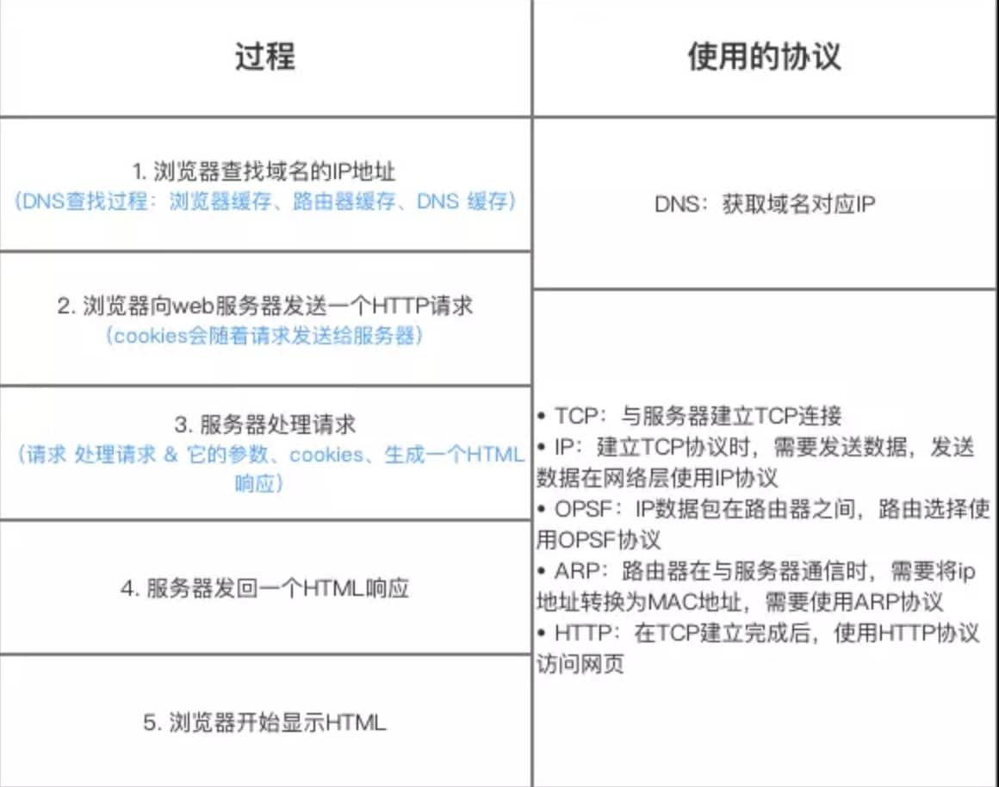

## 操作系统/网络 高频问题

1.  虚拟地址，内存管理等方式

2.  Linux常用命令
3.  进程，线程，协程的各种概念
4.  各种IO, select, poll, epoll, 零拷贝之类的
5.  死锁，死锁检测，死锁恢复，死锁防止
    死锁的四个必要条件：
    - 互斥：该资源任意一个时刻只由一个线程占用。
    - 请求与保持：一个线程因请求资源而阻塞时，对已获得的资源保持不放。
    - 不剥夺条件：线程已获得的资源在未使用完之前不能被其他线程强行剥夺，只有自己使用完毕后才释放资源。
    - 循环等待条件：若干线程之间形成一种头尾相接的循环等待资源关系。
6.  什么是操作系统，用户态内核态，系统调用的概念
7.  进程，线程之间通信的方式
8.  内存管理，分页分段等
9.  TCP, UDP
    TCP和UDP的区别：
    1. TCP是面向连接的，传输数据前，必须先通过三次握手建立连接，完成后需要通过四次护手来释放连接。而UDP是无连接的，不需要建立连接即可发送数据
    2. TCP提供的是可靠的数据传输服务，通过序列号、ACK、超时重传、流量控制、拥塞控制等一系列机制保证数据能够无差错、不丢失、不重复且按顺序到达目的地。而UDP是提供的是不可靠的传入，尽最大努力交付，也没有重传确认等机制。
    3. TCP是有状态的，而UDP是无状态的，发出后就不关心数据包是否到达了
    4. 传输效率上由于TCP需要建立连接，开销较大，效率相对低，而UDP效率更高。
    5. 传输形式上，TCP是面向字节流的，可能会将数据进行拆分和合并，而UDP是面向报文的，不会拆分合并。

    TCP/IP四层模型：应用层、传输层、网络层、网络接口层
    
    常见应用层协议：HTTP、ftp、ssh、dns、websocket。
    传输层常见协议：TCP、UDP
    网络层协议：IP（定义数据包格式、对数据包进行路由和寻址）、ARP地址解析协议

    TCP连接建立的三次握手：
    - 一次握手：客户端发送携带SYN（SEQ=x）标志的数据包给服务端，然后客户端进入SYN_SEND的状态，等待服务端的确认；
    - 二次握手：服务端发送带有SYN + ACK（SEQ=y, ACK = x+1）标志的数据包给到客户端，然后服务端进入SYN_RECV状态；
    - 三次握手：客户端发送带有ACK(ACK = y+1)标志的数据包给到服务端，然后服务端和客户端都进入ESTABLISHED状态，完成TCP握手。

    为什么要三次握手？
    
    主要是为了让双方都确认自己与对方的发送与接收都是正常的。
    - 第一次握手：Client什么都确认不了，Server端确认了对方是发送正常，自己接收正常；
    - 第二次握手：CLient端确认了对方发送正常、接收正常、自己发送正常、接收正常；Server端确认了自己发送正常，
    - 第三次握手：Client端确认了自己发送正常、接收正常、对方发送正常、接收正常；Server端新增确认对方接收正常，至此双方都确认了自己和对方的收发功能都正常。

10. 输入一个URL到渲染完成经过了哪些过程
输入 URL → DNS 解析 → 建立连接（TCP/QUIC + TLS）（客户端发送SYN；服务端返回SYN+ACK；客户端再发ACK，确认建立连接）（TLS握手：协商加密算法；交换证书等） → 发送 HTTP 请求 → 服务器处理返回响应 → 浏览器解析 HTML、构建 DOM/CSSOM → 渲染绘制 → 加载额外资源 → 用户交互。

    主要分为以下过程：
    - 浏览器查找域名的IP地址（DNS查找过程：浏览器缓存、路由器缓存、DNS缓存）
    - 浏览器想web服务器发送一个http请求；服务器处理请求；返回一个HTML响应；这个过程会先伴随TCP连接建立；发送数据在网络层使用IP协议；IP数据包在路由器之间路由选择用到OPSF协议；路由器与服务器通信时，使用ARP协议将ip地址转为MAC地址；TCP连接建立完成后，使用HTTP协议访问网页。
11. HTTP1.0, 1.1, 2.0, 3.0分别有哪些特性

    HTTP1.0：每个请求都需要新建一个TCP连接
    HTTP1.1: 支持长链接，TCP连接可复用于多次请求响应；支持大文件/流式传输；虽然支持长链接，但仍然是串行响应，受队头阻塞限制（多个请求在同一个TCP链接里必须顺序处理，如果前面请求响应没回来，那后面的请求就得排队等待）
    HTTP2.0: 文本报文改为二进制振，解析更高效，且支持多路复用，TPC连接上课并发多个请求/响应，互不阻塞（但是由于TCP是保证字节流的顺序交付，如果一个数据包丢了，那后续数据包就算到了，也得等到前一个数据包重传回来后，才能交给上层应用）。
    HTTP3.0: 基于QUIC（UDP之上），融合了TLS1.3、流式多路复用、拥塞控制，且强制使用TLS加密，安全性更强，基于UDP智商的QUIC协议，每个数据流相互独立，丢了也不会影响其他流。QUIC自己实现了可靠传输、加密、和多路复用，
12. HTTPS的基本概念和流程

    HTTPS是在HTTP基础上，再结合SSL/TLS（SSL改名后）协议，对通信数据进行加密，解决了数据传输透明的问题。

    HTTPS的加密主要是在TLS阶段做的，TLS在握手阶段使用非对称加密来安全协商对称秘钥，后续传输数据时用对称加密来保证高效安全；同时依赖整数和数字签名保证身份认证和数据完整性。

    SSL/TLS核心要素是非对称加密。涉及一个秘钥和一个公钥，秘钥由解密者保存，公钥由发送者（加密者）所致。

    对称加密：通信双方共享唯一秘钥，加解密算法一致，加密方利用秘钥加密，解密方也利用该秘钥解密，保密性主要依赖秘钥K的保存。

    由于公钥是透明的，且任何人都可以捕获到通信包，那可能会有攻击者发送假的公钥，这样可能会使用假的公钥加密后的数据传输，那攻击者就可以捕获这些数据解密了。

    所以出现了证书颁发机构，当客户端向

13. Cookie, Session和JWT的各种概念

    用户向服务器发送用户名、密码、验证码用于登陆系统。

    服务器验证通过后，会为这个用户创建一个专属的 Session 对象（可以理解为服务器上的一块内存，存放该用户的状态数据，如购物车、登录信息等）存储起来，并给这个 Session 分配一个唯一的 SessionID。服务器保存session可以存储在redis（主流）、或者服务器内存中。

    服务器通过 HTTP 响应头中的 Set-Cookie 指令，把这个 SessionID 发送给用户的浏览器。

    浏览器接收到 SessionID 后，会将其以 Cookie 的形式保存在本地。当用户保持登录状态时，每次向该服务器发请求，浏览器都会自动带上这个存有 SessionID 的 Cookie。
    
    服务器收到请求后，从 Cookie 中拿出 SessionID，就能找到之前保存的那个 Session 对象，从而知道这是哪个用户以及他之前的状态了。

    (使用Session时，需要考虑客户端是否支持Cookie；session需要合理设置过期时间；Session Id安全问题，例如设置HttpOnly；设置Secure标志等)

    Token-based认证（JWT：Json Web Token）方式，是一种基于Token的认证授权机制。
    主要包括三部分：Header、payload、Signature

    Header中描述JWT的元数据，定义生成签名的算法及token类型
    
    Payload：存放实际需要传递的数据，包含声明JWT id或者过期时间等。

    Signature: 服务器通过Payload、Header和秘钥使用指定的签名算法（例如SHA256）生成签名。

    用户向服务器发送用户名、密码以及验证码用于登陆系统；
    
    如果用户用户名、密码以及验证码校验正确的话，服务端会返回已经签名的 Token，也就是 JWT；
    
    客户端收到 Token 后自己保存起来（比如浏览器的 localStorage ）；
    
    用户以后每次向后端发请求都在 Header 中带上这个 JWT ；
    
    服务端检查 JWT 并从中获取用户相关信息并校验。

14. Websocket
    websocket是应用层的协议，基于TCP传输层上运行，它的握手过程依赖http/1.1协议，然后升级为websocket协议