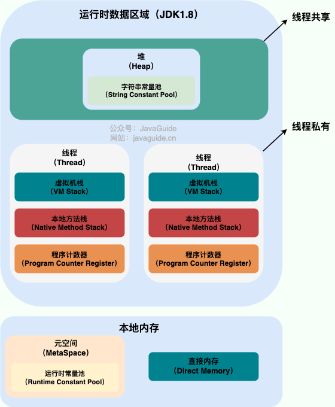
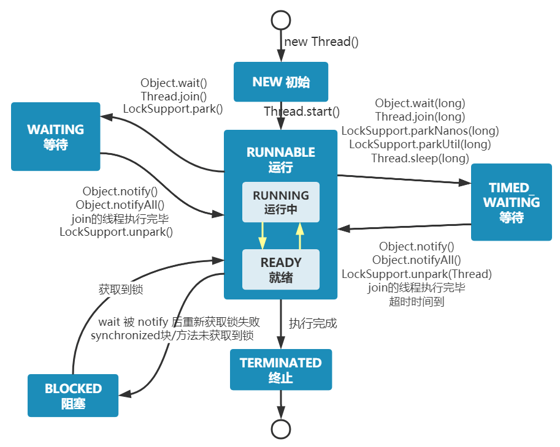
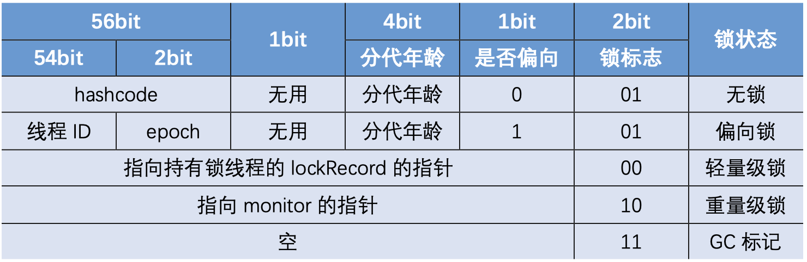
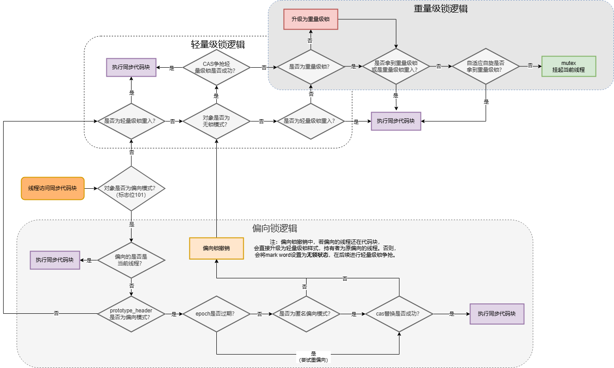
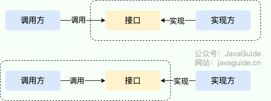

## JAVA

1.  Equals,hashcode方法，equals方法满足哪些特性，hashcode用在了哪些地方，Hashmap中的hashcode怎么用的

    一般定义对象时，需要同时重写equals和hashCode方法，如果不同时重写，在往hashMap中存放对象时，可能会出现相同对象都放进去的情况。

    equals方法用来判断两个对象是否相等，通常在类中重写它。equals方法满足以下几个特性：

    - 自反性：对于任何非空引用x，x.equals(x)应该返回true。
    
    - 对称性：如果x.equals(y)返回true，那y.equals(x)也应该返回true。

    - 传递性：x.equals(y)和y.equals(z)都返回true，那z.equals(x)也返回true。

    - 一致性：如果两个对象多次调用equals()方法在没有修改对象的情况下，结果应该始终一致。

    - 非空性：任何对象与null比较时，equals()应该返回false。

    hashCode方法用于返回对象的哈希值，通常用作哈希表中bucketn的索引。

    hashCode和equals方法的关系：
    
    - 如果两个对象根据equals()比较返回true，那它们的hashcode必须相同。

    - 如果两个对象的hashcode相同，equals()不一定返回true（哈希冲突）。

    - 如果没有重写equals()时，hashcode使用的是Object类的默认实现，通常是对象的内存地址。

    在HashMap中，hashCode()用于确定对象存放在数组中的哪个位置。具体步骤如下：
    - HashMap内部有一个数组，数组中每个元素是一个链表或者红黑树（JDK8后）。
    - 当一个键值对被插入时，hashMap计算key的hashCode，根据这个hashCode定位到bucket位置。
    - 如果发生hash冲突，那会将这些键值放入到该bucket的链表或者红黑树中。
    - 判断key是否相同时，先计算hashcode，如果hashcode相同，则通过equals方法进一步检查是否相等。    

2.  线程池的参数，有哪些线程池类型，线程池的各种抛弃策略适合哪些场景，线程池的原理

    进程是程序的一次执行过程，是系统运行的基本单位，而线程与进程相似，但是是比进程更小的一个执行单位，一个进程中可产生多个线程。
    线程和进程最大的不同在于基本上各进程是独立的，而各线程则不一定，同进程中的线程有可能会互相影响。
    
    Java内存区域如下图所示：

    

    Java内存区域在JVM中可以大致分为线程私有和线程共享两部分，
    - 线程私有部分包括：
        - 程序计数器：保存当前字节码执行位置，多线程情况记录当前线程执行的位置，从而线程被切换回来的时候能知道该线程运行到哪里了；它是私有的主要是为了线程切换后能回复到正确的位置。
        - 虚拟机栈：每个Java方法执行前都会创建一个栈帧来存储局部变量表、操作数栈、常量池引用等信息，方法调用直到执行完，对应栈帧入栈和出栈的过程。
        - 本地方法栈：和虚拟机栈类似，只不过适用于native方法。
        - 这两个栈是线程私有的主要是为了保证线程中的局部变量不被别的线程访问到。
    - 线程共享部分包括
        - 堆
        - 方法区/元空间
        - 运行时常量池。

    **Java内存模型**
    JMM是 Java Memory Model的简称，即Java内存模型，主要定义了Java程序中多线程读写共享变量时的规范，规定了多线程下的可见性、有序性和原子性规则，屏蔽了底层硬件内存模型的差异，例如可见性通过volatile来保证，synchronized也可以通过内存屏障实现可见性；通过volatile或synchronized保证有序性，禁止指令重排序，通过synchronized或其他同步锁机制来保证原子性。JMM还定义了happens-before原则，用来说明不同操作之间的可见性和顺序行。

    happens-before原则：
    - 如果一个操作 happens-before 另一个操作，那么第一个操作的执行结果将对第二个操作可见，并且第一个操作的执行顺序排在第二个操作之前。
    - 两个操作之间存在 happens-before 关系，并不意味着 Java 平台的具体实现必须要按照 happens-before 关系指定的顺序来执行。如果重排序之后的执行结果，与按 happens-before 关系执行的结果一致，那么JMM也允许这样的重排序。

    java内存模型是共享内存的并发模型，线程之间主要通过读-写共享变量来完成隐式通信。

    严格来讲，真正能创建线程的，只能通过Thread类，即Thread实例化后调用start(); 但是可以通过实现Runnable接口、实现Callable接口、线程池、使用CompletableFuture类等方式来提交任务，给到线程去执行。

    Java线程的状态在Thread.State枚举类里有定义，一共有：NEW, RUNNABLE, BLOCKED, WAITING, TIMED_WAITING和TERMINATED。
    
    - NEW：初始状态，线程对象被创建，但是未调用start()方法；
    - RUANNABLE：运行状态 ，线程被调用了start()方法后；
    - BLOCKED: 阻塞状态，例如线程等待获取synchronized锁；
    - WAITING: 等待状态，直到被其他线程显示唤醒（如notify()通知或中断）；
    - TIME_WAITING: 超时等待，超过指定时间后自动返回；
    - TERMINATED: 终止状态，表示该线程已经运行完毕或异常退出；

    Q: 线程间的状态是怎么流转的？

    A: 从NEW -> RUNNABLE（初始态 到 运行态，通过调用线程对象的start()方法）；从RUNNABLE -> BLOCKED（从运行态 到 阻塞态，线程尝试获取synchronized锁失败）；从RUNNABLE -> WAITING（从运行态 到 等待态，通过调用Object.wait() / LockSupport.park()，进入无限等待）；从 RUNNABLE -> TIMED_WAITING（运行态 到 超时等待，通过调用sleep(ms) / join(ms) / wait(ms) 进入超时等待）；从WAITING/TIMED_WAITING -> RUNNABLE（从等待/超时等待 到 运行态，通过调用notify() / notifyAll() / unpark()唤醒）；BLOCKED -> RUNNABLE ( 从阻塞 到 运行，获取锁后 )；RUN -> TERNIMATED（run()执行完毕或者抛异常结束）。

    PS：实际回答时不用所有流转都打出来，只需要简单陈述6种状态含义后，提及从NEW -> RUNNABLE、RUNNABLE -> BLOCKED、RUNNABLE -> WAITING/TIMED_WAITING、RUNNABLE -> TERMINATED是怎么流转的即可。

    Q: join()方法的底层原理是什么？

    A: join()方法本质上是等待另一个线程结束，底层调用了wait()方法，线程A调用ThreadB.join()方法，会让A进入WAITING/TIMED_WAITING状态，直到线程B结束或中断。

    Q: join()会释放锁吗？

    A: 

    Q: Thread#sleep()方法和Object#wait()方法的区别

    A: 共同点，二者都可以暂定线程的执行；不同的点：首先sleep()没有释放锁，而wait()释放了锁。wait方法通常用于线程间的交互/通信，sleep() 通常用于暂停执行，wait()调用后，线程不会自动苏醒，需要别的线程调用同一个对象的notify或者notifyAll()唤醒，而sleep方法执行完成后，线程会自动苏醒。sleep()是Thread类的静态本地方法，而wait()是Object类的本地方法，wait()是让获得对象锁的线程实现等待，会释放当前线程占用的对象锁，所以需要在对象操作。

    Q: Runnable接口和Callable接口有什么共同点和区别？

    A: 共同点是都是接口，都是任务接口用来描述一段需要并发执行的逻辑，都能被线程池执行，都支持多线程唤醒下的任务调度。区别上，首先Runnable只能执行任务，没有返回值，异常也不能往外抛；Callable可以返回结果，还能抛出异常，通常和Future/FutureTask一起用来拿结果。另外需要明确的是，两个接口本身都不能直接创建线程，他们只是“任务模型（可以理解成就是任务）”，真正的线程要考Thread类或者线程池框架来驱动。
    ```
    public class MyRunnable implements Runnable{

        @Override
        public void run(){
            ......
        }
    }

    Thread t = new Thread(new MyRunnable()); // 或者可以使用匿名内部类，或者直接pool.execute(new MyRunnable())提交线程池执行

    // Callable的使用
    public class MyCallable implements Callable<Integer> {
        @Override
        public Integer call() throws Exception {
            return 42;
        }
    }

    FutureTask<Integer> futureTask = new FutureTask<>(task); // 或者配合线程池使用Future<Integer> future = pool.submit(() -> 123);

    Thread t = new Thread(futureTask);
    t.start();

    Integer result = futureTask.get();


    ```


    三个线程交替打印的实现如下：
    ```
    public class ThreeThreadWaitNotify {
    private static final Object lock = new Object();
    private static int state = 0; // 0 -> A, 1 -> B, 2 -> C
    private static final int times = 5; // 每个线程打印次数

    public static void main(String[] args) {
        Thread threadA = new Thread(() -> {
            for (int i = 0; i < times; i++) {
                synchronized (lock) {
                    while (state % 3 != 0) { // 不该 A 打印就等待
                        try {
                            lock.wait();
                        } catch (InterruptedException e) {
                            e.printStackTrace();
                        }
                    }
                    System.out.println("A");
                    state++;
                    lock.notifyAll(); // 唤醒其他线程
                }
            }
        });

        Thread threadB = new Thread(() -> {
            for (int i = 0; i < times; i++) {
                synchronized (lock) {
                    while (state % 3 != 1) {
                        try {
                            lock.wait();
                        } catch (InterruptedException e) {
                            e.printStackTrace();
                        }
                    }
                    System.out.println("B");
                    state++;
                    lock.notifyAll();
                }
            }
        });

        Thread threadC = new Thread(() -> {
            for (int i = 0; i < times; i++) {
                synchronized (lock) {
                    while (state % 3 != 2) {
                        try {
                            lock.wait();
                        } catch (InterruptedException e) {
                            e.printStackTrace();
                        }
                    }
                    System.out.println("C");
                    state++;
                    lock.notifyAll();
                }
            }
        });

        threadA.start();
        threadB.start();
        threadC.start();
        }
    }
    ```


    **线程池的参数**
    
    - corePoolSize: 核心线程数。线程池会保持这些线程，即使线程是空闲的。默认情况下不会回收核心线程
    - maximumPoolSize: 最大线程数
    - keepAliveTime + unit: 非核心线程空闲多久后被回收。
    - workQueue： 阻塞队列，用来存放等待执行的任务，例如ArrayBlockingQueue、LinkedBlockingQueue、PriorityBlockingQueue、SynchronousQueue(同步队列，没有容量，不存储元素，如果有空闲线程，使用空闲线程，没有则新建线程来处理，相当于线程数是无限制)等。
    - handler: 拒绝策略。当任务满了且线程数达到上限时的处理方式，常见的拒绝策略有：
        - AbortPolicy：直接抛出异常，调用方能立刻感知，适用于任务不能丢的情况，必须显示感知失败，或者是想用异常来驱动上层的容错或重试逻辑。
        - CallerRunsPolicy：拒绝时不丢任务，任务交给调用者线程执行，例如任务量大时，宁可降低吞吐量，也不能丢任务，比如日志写入、消息消费，业务能接受延迟但不接受丢失。
        - DiscardPolicy：直接丢弃，不报错，适合对任务可靠性要求很低的情况，但是大部分情况下无法接受，属于业务黑洞了。
        - DiscardOldestPolicy：丢弃队列里最老的任务，再尝试提交，适合任务本身就有高时效性，过期了就没价值那种。
        - 自定义策略：实际工作中常见，例如把任务写日志告警，或者把拒绝的任务转移到MQ里重试。

    线程池处理任务的流程：
    - 如果当前运行的线程数小于核心线程数，线程池会新建线程来执行任务。
    - 否则会尝试把任务放进阻塞队列，
    - 如果任务队列已满，但是运行线程数小于最大线程数，则新建一个线程来执行任务。
    - 如果当前运行的线程数已经等于最大线程数了，那么当前任务触发执行拒绝策略。

    当然线程池可以提前预热，帮助我们在提交任务之前，完成核心现场的创建，即```prestartAllCoreThreads()```.

    如果要关闭线程池，可以调用shutdown(): 不再接收新任务，但会把当前队列里的任务跑完；shutdownNow(): 尝试中断正在执行的任务 + 清空队列。

    Q: 线程池中线程异常后，销毁还是复用？

    A: 在线程池中，线程执行任务时如果抛出未捕获的异常，那这个线程会结束并销毁，不会被复用。但是线程池会感知到线程减少，会根据配置重新创建一个新线程来补位。

    Q: 核心线程空闲时处于什么状态？

    A: 在空闲时间，会一直处于WAITING状态，等待获取任务，当队列中有可用任务时，会唤醒被阻塞的线程，线程的状态会由WAITING状态变为RUNNABLE状态，之后去执行对应任务。 

3.  Thredlocal的原理，为什么容易内存泄漏

    **ThreadLocal** 类允许每个线程绑定自己的值，用于存储线程私有数据，确保不同线程之间的数据互不干扰。
    
    当我们创建一个`ThreadLocal`变量时，每个访问该变量的线程都会拥有一个独立的副本。线程可以通过`get()`方法获取自己线程的本地副本，或通过`set()`方法来修改该线程副本的值，从而避免了线程安全问题。

    ThreadLocal原理如下：

    每个Thread对象里有个`ThreadLocalMap`属性。`ThreadLocalMap`底层是一个自定义Entry数组，可以理解为`ThreadLocal`对象实现的定制化的hashMap，key是ThreadLocal实例本身（用弱引用存储），value是当前线程对应的副本数据。
    Thread
        └── ThreadLocalMap (存放本线程相关的数据)
            └── Entry (key = ThreadLocal 弱引用, value = 实际存储的对象)
    当调用`threadlocal.set(value)`方法时，会拿到当前线程，找到它的`ThreadLocalMap`，以当前`ThreadLocal`作为key存进去value值。`get()`时也类似。

    Q: 为什么要弱引用？

    A: 因为一旦 ThreadLocal 对象本身不再被外部引用，应该允许 GC 把它回收，避免 key 永远存在导致内存泄漏

    Q: 为什么容易内存泄漏？
    
    A: 主要是ThreadLocalMap中的key是对ThreadLocal实例的弱引用，当业务代码不再持有这个ThreadLocal实例时，GC就会把这个key回收掉，但是可能value还是强引用，不会自动清理，结果就会ThreadLocalMap中key = null, value = 对象的数据，value永远占用内存。如果线程是普通的短生命周期的线程，线程结束后，线程实例被回收，那整个`ThreadLocalMap`就被回收，也不会出问题，但是如果是线程池里的核心线程，不会被回收，那它的`ThreadLocalMap`对象也会一直或者，那其中的“孤儿数据”也会一直活着。 因此用完就remove()掉是最好的解决办法。

    Q: 为什么key不能改成强引用？

    A: 首先`ThreadLocalMap`是挂在Thread对象下的，每个线程维护自己的`ThreadLocalMap`，如果改为强引用，那么只要这个Thread存活，它持有的`ThreadLocalMap`就会一直持有`ThreadLocal`。这就以为这创建过的所有ThreadLocal实例都会一直活着，即使没有地方引用这个ThreadLocal实例了，也会因为被`ThreadLocalMap`强引用而不能回收，泄漏范围更大了。
    

4. Syschronized和Lock的区别，AQS的原理，volatile，retrantLock

    **volatile**关键字

    volatile关键字在java中用于修饰变量，使变量具有可见性和有序性。但是不能保证原子性，	在多线程环境中，当一个线程修改了volatile修饰的关键字后，修改后的值对其他线程是立即可见的。其有序性是指使用volatile关键字修饰的关键字会禁止指令重排序。相当于如果不用这个关键字修饰的变量，编译器可能进行指令重排序，提高性能，但是会影响多线程环境下的正确。
	
	保证可见性性的方式：1. 内存可见性协议，每个线程在操作变量时，实际是先从该线程的本地缓存中读写，而不是直接在主内存中操作。但是如果变量被volitale修饰
	则会直接操作主内存，不使用线程本地缓存，这样就使得如果a线程修改了变量，那直接会刷新主内存中的变量值，b线程读取时也会直接读主内存中的变量值
	
	保证有序性的方式：使用内存屏障，volatile关键字修饰的变量在实现中，会在对该变量的读写前都插入读写屏障，	这样来保证指令执行顺序，防止重排序。
	
    总结来讲：
    - volatile 关键字主要用于修饰变量，有两个作用：
        - 保证可见性，即一个线程修改变量后，其他线程能立即看到。当一个变量被volatile关键字修饰时，这就指示编译器，这个变量是共享且不稳定的，每次使用它都需要到主存中读取。
        - 保证有序性，通过内存屏障，禁止指令重排序，确保读写顺序。在对被volatile关键字修饰的变量进行读写操作时，会通过插入特定的 内存屏障 的方式禁止指令重排序。
        - 但是**volatile**关键字不保证原子性。

    ```
    public class Singleton{
        private volatile static Singelton instance；

        private Singleton(){}

        public static Singleton getInstance(){
            if(instance == null){
                synchronized(Singleton.class){
                    if(instance == null){
                        instance = new Singleton();
                    }
                }
            }
            return instance;
        }
    }
    ```
    `instance； = new Singleton()`实际会分三步，1. 为instance分配内存空间；2. 初始化instance；3. 将instance指向分配的内存地址，如果多线程情况下，A线程执行了1、3，这是B线程去执行getInstance方法会发现instance已经不为null了，因此直接返回了，但此时instance还未来得及初始化。

    Q: 什么是乐观锁和悲观锁？

    A: 乐观锁总是假设最好的情况，认为共享资源每次被访问的时候不会出现问题，线程可以不停的执行，无需加锁等待，只是会在提交修改的时候验证对应的资源是否被其他线程修改了。例如CAS算法，atimoic包下的原子类。而悲观锁总是假设最坏的情况，认为共享资源每次被访问的时候就会出现问题，所以每次在获取资源操作的时候就加锁，例如synchronized锁和ReentrantLock都是悲观锁的思想。

    Java中实现CAS是在`Unsafe`类，提供了例如`CompareAndSwapObject()`方法，是一个native方法，这些方法是native的，是直接调用底层的硬件指令来实现原子操作。

    CAS的缺点：
    1. ABA问题，解决思路是在变量前面加上版本号，或者时间戳。
    2. 循环时间开销大，CAS经常使用自旋操作，不成功会一直循环，如果长时间不成功，会给CPU带来较大的开销。
    3. 仅针对单个变量操作有效。

    **synchronized**
    synchronized 关键字用于解决多线程环境下的同步问题，可以修饰实例方法、静态方法和代码块。

    修饰实例方法 → 锁的是当前实例对象 (this)。

    修饰静态方法 → 锁的是当前类的 Class 对象。

    修饰代码块 → 锁的是 synchronized(obj) 中传入的对象。

    修饰代码块时，编译器会在字节码中插入 monitorenter 和 monitorexit 指令。修饰方法时，方法的访问标志上会加上 ACC_SYNCHRONIZED，JVM 在方法调用时自动获取和释放锁。

    在`synchronized`锁底层实现以 HotSpot 为例，锁的实现依赖对象头中的 Mark Word（对象头的一块区域，存储锁的各种状态标识位） 和 ObjectMonitor（当对象被竞争时，会关联到一个 ObjectMonitor 对象）。当执行monitorenter 时，线程会尝试获取对象监视器的所有权。如果没有竞争，JVM会使用 偏向锁 或 轻量级锁 来优化。如果竞争激烈，会升级为 重量级锁，此时依赖 ObjectMonitor（基于操作系统的互斥量实现）。

    在Java6之后，`synchronized`引入了大量的优化例如自旋锁、适应性自旋锁、锁消除、锁粗化、偏向锁（jdk18中被彻底放弃）、轻量级锁等技术来减少锁操作的开销，这些优化让`synchronized`锁的效率提升了很多。`synchronized`锁主要存在四种状态，依次是无锁状态、偏向锁状态、轻量级锁状态、重量级锁状态，他们会随着竞争的激烈而逐渐升级。锁可以升级不可降级，这种策略是为了提高获得锁和释放锁的效率。

    锁升级的过程：
    - 假设某共享资源被`synchronized`修饰
    - （无锁）初始时，共享资源不涉及多线程的竞争访问，这时是无锁状态。
    - （偏向锁）当共享资源首次被访问时，JVM会对该共享资源对象做一些设置，比如将对象头中`Mark Word`偏向锁标志位设置为1，通过一次 CAS 操作，尝试线程id设置为当前线程ID（这里是操作系统的线程id），后续当前线程再次访问这个共享资源时，会根据**偏向锁标识**跟**线程id**进行对比，对比相同则直接获取到锁，这就是synchronized的可重入功能。
        
    - （轻量级锁）当多个线程同时申请共享资源锁的访问时，这就产生了竞争，JVM会先尝试用轻量级锁，以CAS方式来获取锁（一般就是自旋加锁，不阻塞线程，采用循环等待的方式），成功则获取到锁，状态为轻量级锁，失败（达到一定的自旋次数还未成功）则锁升级到重量级锁。
    - （重量级锁）如果共享资源锁已经被某个线程持有，此时是偏向锁状态，未释放锁前，再有其他线程来竞争时，会升级到重量级锁；另外轻量级锁状态多线程竞争锁时，也会升级到重量级锁，重量级锁由操作系统来实现，性能消耗相对较高。

        
    
    参考：https://tech.youzan.com/javasuo-yu-xian-cheng-de-na-xie-shi/

    **ReentrantLock**

    `ReentrantLock`是一个可重入且独占式的锁，和`synchronized`关键字作用类似，不过`ReentrantLock`更灵活，更强，增加了轮询、超时、中断、公平锁非公平锁等高级功能。默认是非公平锁。公平锁和非公平锁的区别就是锁被释放后，是否按申请锁的先后顺序保证锁的获取。

    `ReentrantLock`原理是基于AQS实现的，核心是一个阻塞队列 + CAS原语，在加锁时，先尝试用CAS更新状态（State）来获取锁，如果失败，线程进入队列等待（阻塞）；在释放锁时，state减1，检查state是否为0，为0则表示锁完全释放。
    可以理解为AQS内部的队列 + CAS + AQS内部的state变量实现ReentrantLock，其中获取锁时，线程会用CAS更新state变量，CAS成功，获取锁成功，失败获取锁失败；失败后的线程都会进入到AQS内部的队列，队列里的线程都会被挂起，等锁释放后，会从队列头部唤醒下一个线程。在释放锁时，持有锁的线程会将state变量减1，然后判断state是否等于0，等于0说明锁完全释放

    PS：非公平锁实现 获取锁时，已入队的线程只能按顺序来（避免一直CAS尝试，而设计成唤醒所有的线程一块抢又会出现很多无效竞争，开销也比较大），未入队的线程会直接尝试CAS获取锁。


    Q: `synchronized`和`ReentrantLock`有什么区别？

    A: 首先共同点二者都是可重入锁，都可用于解决多线程环境下共享资源的线程安全问题；不同点从语法上看，`synchronized`是java关键字，是由JVM级别支持，简单易用，出了作用域就相当于释放锁，而`ReentrantLock`是JUC包里的一个类，需要手动加锁、释放锁。另外相对于`synchronized`，`ReentrantLock`增加了一些高级功能，主要有三点：
    - 提供了等待可中断功能，`ReentrantLock`提供了能够终端等待锁的线程的机制，当前线程通过调用`lock.lockInterruptibly()`，等待获取锁，如果其他线程调用了它的`interrupt()`方法，它不会继续等，而是立即抛出一个InterruptedException，从等待中醒来，做其他事情；而`synchronized`则不会中断。
    - 可实现公平锁，`ReentrantLock`可以指定是公平锁还是非公平锁，而`synchronized`只能是非公平锁。
    - 支持超时：`ReentrantLock`提供了`tryLock(timeout)`指定等待获取锁的最长等待时间，如果超过等待时间，就会获取锁失败，不会一直等待。
    - 可实现选择性通知（锁绑定多个条件）：synchronized可以借助`wait()/notify()`实现等待通知机制。而`ReentrantLock`实现选择性通知需要借助`Condition`接口与`newCondition()`方法。

    例如通过选择性通知实现生产者和消费者模型：
    ```
    public class ProducerAndConsumer {
    private static final ReentrantLock lock = new ReentrantLock();
    private static final Condition notFull = lock.newCondition();
    private static final Condition notEmpty = lock.newCondition();
    private static final Integer capacity = 5;
    private static Integer size = 0;
    public static void main(String[] args) {
            Thread producer = new Thread(new Runnable() {
                @Override
                public void run() {
                    try {
                        while(true){
                            lock.lock();
                            if(size.equals(capacity)){
                                notFull.await(); // 等待非慢的條件
                            }
                            size++;
                            System.out.println("生產....");
                            notEmpty.signal();
                            lock.unlock();
                            Thread.sleep(500);
                        }
                    }catch (Exception e){
                        e.printStackTrace();
                    }
                }
            });
            Thread consumer = new Thread(new Runnable() {
                @Override
                public void run() {
                    try {
                        while(true){
                            lock.lock();
                            if(size == 0){
                                notEmpty.await(); // 等待非空的條件
                            }
                            size--;
                            System.out.println("消費....");
                            notFull.signal();
                            lock.unlock();
                            Thread.sleep(500);
                        }
                    }catch (Exception e){
                        e.printStackTrace();
                    }
                }
            });

            producer.start();
            consumer.start();
        }
    }
    ```

    **ReentrantReadWriteLock**
    `ReentrantReadWriteLock`实现了`ReadWriteLock`接口，是一个可重入的读写锁，既可以保证多个线程同时读的效率，同时又可以保证写入操作时的安全。对于读多写少的场景。如果用一般锁进行并发控制，就会读读互斥、读写互斥、写写互斥，效率太低了，读写锁的产生就是为了优化这种场景的效率。

    其中的 WriteLock 写锁是悲观锁、排他独占锁、互斥锁。而 ReadLock 读锁是共享锁、乐观锁

    *读锁升级*在线程持有读锁的情况下，该线程不能取得写锁(因为写锁是独占锁，获取写锁的时候会去检查有没有其他线程持有读锁，只看“读锁计数 > 0”就失败，不管读锁是不是被当前线程持有)。换句话说，`ReentrantReadWriteLock`不支持读锁升级为写锁。如果支持的话，就可能会引入死锁问题，例如：线程A持有`ReentrantReadWriteLock`对象的读锁，想升级为写锁，于是等待所有其他读锁释放，线程B也持有该对象的读锁，也想升级为写锁，这样就会变成两边互相等待，就形成了死锁。

    可以这样理解：写锁是独占锁，获取时必须满足：1. 没有线程持有读锁；2. 没有线程持有写锁

    *写锁降级*在线程持有写锁的情况下，该线程可以继续获取读锁（获取读锁时如果发现写锁被占用，只有写锁没有被当前线程占用的情况才会获取失败）。

    一般锁并发控制的规则：读读互斥、读写互斥、写写互斥；而读写锁的并发控制规则：读读不互斥、读写互斥、写写互斥、*只有读读不互斥*。
    https://mp.weixin.qq.com/s/h3VIUyH9L0v14MrQJiiDbw

    **AQS**

    AQS的全程是`AbstractQueueSychronizer`抽象队列同步器。是一个抽象类，提供了一个通用框架，用于实现各种同步器，可以将它理解为一个并发工具的地基，例如`ReentrachtLock`，`CountDownLatch`都是基于AQS来实现的。通过封装底层的线程同步机制，AQS将复杂的线程管理逻辑隐藏起来，开发者只需要关注具体的同步逻辑。

    AQS的核心思想是，如果被请求的共享资源空闲，则将当前请求资源的线程设置为有效的工作线程，并且将共享资源设置为锁定状态，如果被请求的共享资源被占用，那么就需要一套线程阻塞等待及被唤醒时的锁分配机制，这个机制在AQS中是基于 CLH 锁进一步优化实现的。

    Q: AQS的原理？

    A: AQS 的核心是一个int类型的state变量 和 一个FIFO的队列来管理线程的获取和释放资源。获取资源时，线程会先通过CAS修改state变量来尝试获取，如果失败，就会进入CLH变体的双向队列，然后挂起等待。释放资源时，持有资源的线程通过CAS修改state，如果资源完全释放了，就会唤醒队列中的下一个节点，让它去竞争锁。AQS提供了模板方法，例如：`tryAcquire()`, `tryRelease()`，不同的同步器/锁（例如ReentrantLock、CountDownLatch）只需要实现这部分逻辑，就能利用AQS提供的队列和线程调度机制。总结起来AQS本质上就是一个排队获取资源的框架，用CAS作乐观尝试，用队列做有序等待，把乐观锁和阻塞机制结合起来。


    **CountDownLatch**

    CountDownLatch是一个同步工具类，用来让一个或多个线程等待，知道一组操作完成。它内部是基于AQS实现的，用一个state计数器，其初始值由CountDownLatch构造函数指定，每次调用`countDown()`方法来让计数器减一，当计数器减到0时，所有在await()上等待的线程都会被唤醒继续执行。例如可以用于 主线程等待多个子任务完成后再继续，比如并行查询不同的数据源后再汇总结果。
    ```
    import java.util.concurrent.CountDownLatch;

    public class ProductDetailPage {
        public static void main(String[] args) throws InterruptedException {
            int taskCount = 3; // 假设要查三类数据
            CountDownLatch latch = new CountDownLatch(taskCount);

            // 任务1：查商品基本信息
            new Thread(() -> {
                System.out.println("查询商品基本信息...");
                sleep(1000);
                latch.countDown(); // 完成一个任务
            }).start();

            // 任务2：查库存
            new Thread(() -> {
                System.out.println("查询库存...");
                sleep(2000);
                latch.countDown();
            }).start();

            // 任务3：查评价
            new Thread(() -> {
                System.out.println("查询评价...");
                sleep(1500);
                latch.countDown();
            }).start();

            // 主线程等待所有任务完成
            System.out.println("主线程等待数据加载...");
            latch.await();
            System.out.println("所有数据准备完毕，渲染商品详情页！");
        }

        private static void sleep(long ms) {
            try { Thread.sleep(ms); } catch (InterruptedException ignored) {}
        }
    }

    ```
    类似的还有CyclicBarrir，也是一个同步工具类，用来让一组线程在到达某个屏障点时相互等待，知道所有线程都到达凭着再一起继续执行。可以重复使用，常见场景就是多线程分阶段写作，比如分段计算后统一合并结果，或者模拟赛跑中所有人准备好再一起出发。

    ```
    import java.util.concurrent.BrokenBarrierException;
    import java.util.concurrent.CyclicBarrier;

    public class RaceDemo {
        public static void main(String[] args) {
            int runners = 5;
            CyclicBarrier barrier = new CyclicBarrier(runners, () -> {
                System.out.println("所有人准备就绪，开始比赛！");
            });

            for (int i = 1; i <= runners; i++) {
                final int id = i;
                new Thread(() -> {
                    try {
                        System.out.println("选手 " + id + " 准备中...");
                        Thread.sleep((long)(Math.random() * 2000));
                        System.out.println("选手 " + id + " 准备完成！");
                        barrier.await(); // 等待其他线程
                        System.out.println("选手 " + id + " 开始跑！");
                    } catch (InterruptedException | BrokenBarrierException e) {
                        e.printStackTrace();
                    }
                }).start();
            }
        }
    }
    ```

5.  JVM的原理，垃圾回收，分代收集的算法，各种问题怎么排查（频繁Full GC，内存占用大，OOM等），JVM各种参数的优化。
    **介绍下java内存区域**
    JVM内存区域也就是jvm运行时数据区，主要包括：堆、方法区(1.8之后移除)、虚拟机栈、本地方法栈、程序计数器这几部分。
    **JVM原理**
    首先JVM是java程序运行的虚拟计算机，它屏蔽了底层操作系统和硬件的差异，让Java程序一次编译，导出运行。

    在程序运行时，类加载器把字节码加载到内存，JVM在运行时数据区分配对象内存，执行引擎负责解释执行，同时在后台，有垃圾回收器运行，自动管理堆内存。

    **Java创建对象的五步**
    1. 类加载检查，虚拟机先检查类是否已加载、解析和初始化；如果没有则通过类加载机制，把类的元数据加载到方法区（1.8后就是元空间）；确保类的结构信息在JVM内部是可用的。
    2. 分配内存，JVM在堆上为分配一块连续的内存，分配方式由两种，指针碰撞（Serial、ParNew的GC收集器）和空闲列表（CMS收集器），通过CAS和失败重试来保证多线程环境时的线程安全。
    3. 初始化零值，分完内存后，JVM会把对象的内存空间都置为零值。
    4. 设置对象头，为新对象设置对象头，包括锁标志位，GC分代年龄等
    5. 执行init构造函数。整个对象创建流程完整。

    **对象分配年龄**
    1. 对象优先在Eden区分配（而大对象则会直接进入老年代，），分配时，如果Eden区没有足够的内存使用，那JVM会发起一次Minor GC，如果对象在Eden区出生后，并经过第一次Minor GC后仍然存活，并且能够被Survivor区容纳，则会将对象移动到Survivor区，并且对象年龄设为1，在Survivor区每熬过一次Minor GC，对象年龄就增加1岁，年龄到达一定程度后，就会被晋升到老年代中。
    2. 新生代对象是指在 Eden 区和 Survivor 区的两部分，新生代里的垃圾回收称为Minor GC / Young GC。
    3. 除了新生代对象之外的区域存放的对象都叫老年代对象，老年代对象的垃圾回收称为Mijor GC / Old GC。
    4. 而Full GC是指整个堆和方法区的垃圾回收

    **对象是否存活**
    1. 引用计数法。给对象加一个计数器，当一个地方引用了，则计数器加一，引用失效后减一，但是可能出现循环引用的问题。
    2. 可达性分析法。通过一系列称为“GC Roots”的对象作为起点，开始向下搜索，节点走过的路径称为引用链，如果一个对象从“GC Roots”没有任何引用链相连的话，则证明该对象是可回收的。
    3. 一些作为GC Roots的对象：
        - 虚拟机栈中引用的对象（例如方法内声明的对象）
        - 本地方法栈中引用的对象（例如本地方法中持有的对象）
        - 方法区中静态属性引用的对象（static声明的对象）
        - 方法区中常量引用的对象（static修饰的常量引用的对象）
        - 所有被同步锁持有的对象
    **引用类型**
    - 强引用，不会主动回收
    - 软引用，如果内存空间不足，则会回收这些对象
    - 弱引用，发现则直接回收
    - 虚引用，相当于没有引用，任何情况都可能会被回收

    **分代/垃圾收集算法**
    - 标记-清除算法，首先标记出所有不需要回收的对象，在标记完成后，统一回收掉所有没有被标记的对象。效率不高且会产生内存碎片。
    - 复制算法，为了解决内存碎片问题，将内存分为大小相同的两块，每次使用其中一块，当这一块的内存使用完后，就将还存活的对象都复制到另一块内存中，再把原来的内存统一清理。但是如果针对大对象，复制的效率也会很低。
    - 标记-整理算法，标记过程与标记-清楚算法一致，但是后续不是清除，而是直接对可回收对象回收，让所有存活对象向一端移动，清理掉端边界以外的内存。效率也不高

    - 分代收集算法，针对新生代和老年代对象的不同特点，新生代大量对象都会短时间死去，使用复制算法，只需要复制少量对象即可完成垃圾收集，而老年代则使用标记-清除或者标记-整理算法来垃圾回收。


    **常见的JVM参数**
    - `-Xms<heap size>[unit]` 设置堆初始大小
    - `-Xmx<heap size>[unit]` 设置堆的最大容量，例如`-Xms4G -Xmx4G`

    **常见的命令**
    - `jps` 打印所有java进程
    - `jcmd <pid> VM.flags` 打印所有GC相关的参数
    - `jstat -gc -h3 1 1000 10` 打印虚拟机运行状态信息 示例为分析进程 id 为 31736 的 gc 情况，每隔 1000ms 打印一次记录，打印 10 次停止，每 3 行后打印指标头部。
    - `jmap ` 用于生成堆转储快照，快照文件可以用MAT工具来分析
    - `jstack pid` 生成虚拟机线程的当前时刻的快照


6.  CMS, Parralel, G1等垃圾回收器的原理
    - Serial收集器，单线程收集器。没有线程交互的开销，简单高效。
    - ParNew收集器，是Serial收集器的多线程版本，
    - Parallel，多线程执行垃圾回收，停顿时间更短，适合多核CPu，追求吞吐量的应用，新生代使用复制算法，老年代使用标记-整理算法
    - CMS收集器，停顿时间短，收集阶段经过初始标记（短暂暂停，标记与GCroot相连的对象）、并发标记（同时开启GC线程和用户线程，但是用户不断更新引用域，所以这阶段的GC线程标记无法保证可达性分析的实时性，所以需要跟踪记录发生引用更新的地方）、重新标记（STW，修正并发标记期间用户线程运行导致引用发生变动的记录，暂停时间较长）、并发清除（开启用户线程活动，同时GC线程开始对未标记区域清扫，不进行整理，仅清除，所以会产生内存碎片）。在Java9中标记为过时，在Java14中被移除
    - G1收集器，是JDK9+的默认收集器，特点如下：
        - 并发。充分利用CPU、多核环境下的硬件优势，使用多个CPU核心缩短STW时间，
        - 分代收集。不需要配合其他收集器使用即可独立管理整个堆，但还是保留了分代的概念。
        - 空间整合。G1从整体上看是基于标记-整理算法实现。从局部看是标记-复制算法实现。
        - 可预测的停顿。
    分为以下步骤：
    - 初始标记，短暂停顿，标记与GC roots可直接引用的对象
    - 并发标记，与应用程序并发执行，标记所有可达对象
    - 最终标记，短暂停顿，处理并发标记期间少量未处理的应用变更的对象
    - 筛选回收，根据标记结果，选择回收价值高的对象，复制存活对象到新区域，回收旧区域的内存，这一阶段包含一个或多个STW。G1收集器维护了一个优先级的列表，每次优先回收价值最大的Rigion。
    
    
    - ZGC收集器，也采用标记复制算法，只是做了很多的改进。可以将STW时间控制在几毫秒且出现STW的情况更少。

    https://tech.meituan.com/2020/11/12/java-9-cms-gc.html
    - `jps` 打印所有java进程


7.  JAVA类加载的过程与这样做的原因，有没有办法打破双亲委派，Class这个类在哪一块区域

    **类加载过程**
    类加载过程包括加载->连接->初始化，其中连接又包括验证->准备->解析三步。

    加载时，通过全路径类名获取此类的二进制字节流，将字节流代表的静态存储结构转为方法区运行时数据结构，在内存中生成一个代表该类的class对象，作为方法区访问这些数据的入口。
    验证主要是为了防止恶意代码的运行，例如文件格式、元数据、字节码等是否正确，验证类是否符合class文件格式，是否有父类、程序语义是否符合逻辑
    准备阶段是正式为类变量分配内存并设置变量初始值的阶段（仅包括类变量）。
    解析阶段是将常量池内符号引用替换为直接引用的过程。
    初始化阶段调用clinit方法，带锁，即完成构造方法的调用。

    类加载器是一个负责加载类的对象。即classLoader，JVM中有内置其实现。除了jvm提供的内置的类加载器实现，也可以自定义类加载器的实现。如果想打破双亲委派模型，可以自定义类加载器，重写类中的loadClass()方法（例如自定义类加载器时，重写loadClass()时先自己尝试加载，找不到再去委派给父类加载去加载。）。如果不想打破，则可以重写其findClass()方法。

    **双亲委派**
    当一个类加载器接收到加载请求时，会先将请求转发给父类加载器。在父类加载器没有找到所请求的类的信息时，该类加载器才会尝试加载。执行流程如下：
    - 在类加载时，先判断当前类是否被加载过，已经加载过的类会直接返回，否则才会尝试加载。
    - 类加载器在加载时，首先不会自己去尝试加载，而是将请求委托给父类加载器，即调用父加载器的loadClass()方法，这样最终所有的加载请求，都会传送到最顶部的BootstrapClassLoader类，
    - 只有当父类加载器，无法完成类加载请求时（没有找到对应的类信息），子加载器才会调用自己的findClass()方法来加载类。
    - 如果子加载器，也无法加载，则会抛出ClassNotFoundException异常。

    - 这样做的好处是避免了类的重复加载（类名相同但被不同的类加载器加载，会被视为不同的类）和防止核心API被篡改。
    


8.  Spring中Bean的生命周期，Spring MVC的流程，Spring IOC和AOP的原理，为什么动态代理必须基于接口？

    **Spring中Bean的生命周期**
    在spring中是通过doCreateBean方法来创建bean对象的，大概会经过实例化、属性赋值、初始化、销毁这几个阶段。
    - 实例化：实例化时，首先会判断是否为单例的bean，如果是的话会先从已有的bean map中remove掉，然后通过createBeanInstance来通过反射实例化Bean。
    - 属性赋值：根据BeanDefinition中的依赖信息，为bean设置相关属性和依赖注入，另外`AutowiredAnnotationBeanPostProcessor`;`@Resource`;`@Value`都是在这个阶段生效。
    - 初始化：初始化分为几个步骤，首先是Aware接口回调，例如`BeanNameAware.setBeanName()；BeanFactoryAware.setBeanFactory(); ApplicationContextAware.setApplicationContext()`；然后试BeanPostProcessor前置处理`postProcessBeforeInitlization()`; 接着是自定义初始化方法调用，如果实现了InitlizingBean接口，则调用afterPropertiesSet()方法，如果在注解中或者xml中指定了init-method()则调用该方法，最后是BeanPostProcessor的后置处理`postProcessAfterInitlization()`, AOP就是在这里用代理对象。
    - 销毁：容器关闭时，调用Bean的销毁回调方法，释放Bean所持有的资源。

    **IOC**
    IOC（控制反转）是一种设计思想，而不是具体的实现，Ioc的思想是将原本在程序中手动创建对象的控制权，交给Spring框架来管理，通过容器（ApplicationContext / BeanFactory）统一管理对象（Bean）的创建、依赖注入、生命周期与销毁。避免手动 new 对象，降低对象之间的耦合度依赖程度。

    IoC的底层和Bean的生命周期关系非常密切，主要包括几个步骤：
    - 配置元信息，Spring要知道需要管理哪些Bean、依赖关系。例如开发时通过xml配置或者@Configuration + @Bean、@ComponentScan注解扫描指定包，将这些配置信息解析成BeanDefinition(Bean的定义对象)
    - 容器启动 + BeanDefinition 注册，容器（ApplicationContext）启动时，会扫描所有的配置文件、注解类，将每个类的元信息（BeanDefinition）注册到 BeanDefinitionMap中
    - Bean实例化，容器会根据BeanDefinition反射调用构造方法实例化对象。
    - 容器会检查bean之间的依赖关系，从容器中拿到Bean实例，然后注入。
    - 初始化与扩展，在Bean初始化时，会调用一些预留的扩展方法例如检查是否实现了Aware接口、前置、后置初始化方法调用等。
    - 初始化之后就是可以使用的状态了，放入到Bean实例的池子中
    - 销毁，容器关闭时，销毁Bean，回收资源。

    而SpringBoot在此基础上，做了很多自动化封装，少了很多配置的操作，主要流程包括：容器创建、加载BeanDefinition（通过注解@ComponentScan或者@EnableAutoConfiguration扫描声明的bean）、Bean的实例化和依赖注入、容器就绪，所有Bean是可使用状态。

    **AOP**
    AOP即面向切面编程，AOP将横切关注点例如日志记录等代码从核心逻辑中抽离出来，通过动态代理、字节码操作的技术，实现代码的复用和解耦，提高代码的扩展性。
    
    AOP原理整体是基于 代理模式 + 反射 + IoC生命周期扩展点（BeanPostProcessor）实现的。

    如果某个类的方法被切面拦截，那么在Bean生命周期走到初始化后置处理阶段（BeanPostProcessor）时，会触发AOP代理创建器，它会检查Bean是否需要代理，如果需要，就不会直接把Bean放入到容器中，而是通过反射（JDK Proxy或CGLIB代理）生成一个代理对象，这个代理对象持有原始对象的引用，把代理对象放入到容器中，替换掉原始对象。

    JDK提供的Proxy机制实现时是需要根据该接口生成一个新的实现类，实现目标对象的接口方法，而不是继承目标类本身，所以JDK动态代理必须要基于接口，如果目标类没有接口，就会使用CGLIB代理，生成一个子类，通过方法拦截的方式增强父类的方法。


    **Spring MVC的流程**
    ![Spring MVC的流程图image-19.png)

    1. Http请求过来时，会通过 DispatcherServlet 拦截请求。
    2. DispatchServlet 会根据请求信息调用 HandlerMapping。HandlerMapping 根据url / 注解查找能处理的handler（也就是Controller），并将请求涉及到的拦截器和Handler封装好。
    3. DispatchServlet 调用 HandlerAdapter 适配器来进行对应controller中方法的调用
    4. 如果前后端分离后，会将方法调用结果交给 HttpMessageConverter 转换为JSON返回给前端。


9.  各种Collection的原理，Hashmap，Hashtable，ArrayList，LinkedList，Hashset，Treemap，ConcurrentHashMap（重点，扩容机制，写入机制，新旧版本对比（阻塞队列等））

    **CopyOnWriteArrayList**
    arrylist是非线程安全的， 如果要使用线程安全的list，可以考虑CopyOnWriteArrayList，其读操作时完全无需加锁的，且写操作也不会阻塞读操作，只有写写才会互斥，这样保证读操作性能可以大幅度提升。其核心思想主要是采用了Copy-On-Write（写时复制）的策略。

    当需要修改（add，set，remove等操作）CopyOnWriteArrayList的内容时，不会直接修改原数组，而是先创建底层数组副本，对副本数组进行修改，修改完后再赋值回去。适合读多写少的并发场景。缺点是：内存占用比较大，每次都需要赋值；写操作开销比较大，写入频繁的场景下，性能可能会受到影响；存在一定程度上的数据一致性问题。

    CopyOnWriteArrayList内部使用的是ReetrantLock来加锁的。

    **HashMap**

    HashMap主要用来存放键值对，它是基于哈希表实现，是非线程安全的，可以存储null的key和value但是null作为key只能有一个，null作为value可以有多个。

    HashMap在JDK1.8之前是由数组+链表组成的，链表主要为了解决哈希冲突。在1.8之后，HashMap在解决哈希冲突时有了较大变化，当链表长度大于等于阈值后，会将链表转为红黑树（转红黑树前会判断，如果当前数组长度小于64，会先进行数组扩容，而不是直接转换红黑树），以减少搜索时间。

    hashMap中通过hash & (n-1) 来获取元素在数组中的位置原因主要是效率和均匀分布，按位与操作直接在二进制位上进行的，速度更快且分布更均匀，这样相当于取hash值的低位 去 跟 数组位置去操作。

    put()的过程：

    HashMap通过key的hash方法获取得到hash值，然后通过（n-1）& hash 判断当前元素存放的位置，如果当前位置存在元素，就判断该元素是否与要存入的元素的hash值及key是否相同，如果相同的话，直接覆盖，不相同的话通过拉链法解决冲突。而jdk1.8之后，会先根据hashMap数组来决定是否转换为红黑树，否则只是执行resize()方法对数组扩容。

    resize()过程：

    HashMap通过调用resize()进行扩容，扩容会伴随着重新hash分配，并且会遍历hash表中的所有元素，是比较耗时的。
    
    HashMap在元素数量超过阈值（容量 * 负载因子，默认0.75）时会扩容，一般是翻倍容量。扩容时会把原来的节点迁移到新数组，JDK1.8优化了扩容过程，只需要根据hash值的新增的那个bit是1还是0来判断元素是否需要移动到新位置，不必重新计算hash。但是扩容时很耗时的，而且在并发情况下可能出问题。

    为什么hashMap是线程不安全的？

    主要是：
    - 多个线程同时进行put(),可能同时我那个同一个桶里写数据，导致数据覆盖丢失的情况
    - 扩容过程不是原子操作，在JDK1.7的链表头插法迁移里，如果两个线程同时扩容，可能导致环形链表，虽然在1.8中改成了尾插法，避免了环，但依然可能因为并发迁移导致数据覆盖丢失。
    - 总结来说主要是因为内部没有加锁控制，多个线程同时put或扩容时会互相覆盖数据。


    **ConcurrentHashMap**

    ConcurrentHashMap保证线程安全在Jdk1.7是由分段锁来实现的，整个Map被分成多个Segment，每个Segment维护一部分桶，put/get操作只锁定某一个segment，相当于锁分段，但是确定是Segment是固定数量的，并发度有限。

    ConcurrentHashMap相对于HashTable来讲，虽然二者都是线程安全的，且底层数据结构都比较类似，但是HashTable是的锁粒度比较粗，是方法级别的synchronized，并发性能低；而ConcurrentHashMap锁粒度会相对更细，并发度和性能都会更好。

    而在jdk1.8则抛弃了Segment，改用CAS + synchronized 的方式来实现，锁粒度更小，只锁住某个桶的头节点，同时还支持链表转红黑树和多线程扩容。
    - 插入时，先尝试用CAS把同位置设置成新节点，如果成功，就不用加锁；失败说明有竞争，进入锁逻辑。
    - synchronized锁定链表/红黑树的头节点，这样对某个桶的链表或树加锁，不会影响整个表，避免大面积锁竞争。
    
    put时要用synchronized，而不是完全依赖CAS，主要是由于CAS适合单变量更新，不适合复杂逻辑，在put操作中，不仅要新写入节点，还涉及例如遍历桶链表查重、链表转红黑树等一系列操作；另外CAS在冲突激烈时效率低，如果很多线程同时竞争同一个桶位置，CAS失败率高，就会反复自旋重试，性能反而下降，而synchronized反而会更高效点，而且只锁住桶头节点，即使加锁了也能保证并发度。

    在扩容时，ConcurrentHashMap不是单线程完成的， 而是允许多线程协作，当一个桶正在迁移时，会用forwardNode（持有指向新数组的引用）占位，其他线程访问时就知道该桶已经迁移过了，会直接去新表；扩容任务会被分成多个小段，多个线程通过CAS抢任务并行迁移；在迁移具体桶时会用synchronized保证链表/树的安全。

    如果你来涉及一个高并发的线程安全的HashMap，你怎么做？

    首先需要明确设计目标：线程安全、高并发性能、可扩容性。在实现方式上，可以采用分段锁或桶级别的锁 + CAS来减少竞争，同时在扩容时用协作迁移的方式保证数据一致性。如果是读多邪少的场景，还可以考虑Copy-On-Write（写操作时复制一份新数组，修改后替换旧数组；读操作不加锁）；如果追求极致性能，可以尝试无锁化方案（CAS）但是可能实现复杂。jdk1.8中的ConcurrentHashMap其实就是一个挺不错的这种方案，既利用CAS乐观锁提升并发性能，又用synchronized保证局部互斥。

    CAS是线程安全的主要是因为它是一个原子操作，而不是我们常规理解的先比较后交换，这种两步的情况。是由CPU保证的，但是可能会出现“ABA”问题，变量初始是A，线程A读到变量A，准备CAS，线程B把变量由A改成B，由改为了A，线程A执行CAS发现还是A，于是成功了，但其实值被改过，解决方法是可以给值加上版本号，变成（值，版本号）一起比较。

    ConcurrentHashMap中的size()操作只是近似的值，不能保证完全精确，如果要保证完全精确，可以考虑自己维护一个独立的计数器，保证实时一致。

10. String, StringBuffer, StringBuilder的区别，String不可变有什么好处？
11. NIO, BIO, AIO
    
    UNIX系统中，I/O模型一共有5种：同步阻塞I/O，同步非阻塞I/O，I/O多路复用、信号驱动I/O和异步I/O
    - 同步阻塞I/O：最传统的方式，进程调用read后，一直阻塞住，知道内核把数据准备好并拷贝到用户空间。
    - 同步非阻塞I/O：调用read后，如果内核数据还没准备好，立刻返回一个错误，应用进程不断轮询调用去看是否数据已经准备好，浪费CPU。
    - I/O多路复用：内核提供统一的系统调用（select、poll、epoll），让进程可以同时监控多个socket。
    - 信号驱动I/O：将socket设置为信号驱动I/O后，当内核检测到数据准备好时，会向进程发一个信号。应用进程此时取执行read，把数据拷贝处理。
    - 异步I/O：进程发起异步I/O操作，比如aio_read，内核负责将数据准备好且拷贝到用户空间，完成后再通知进程。
    
    Java 中有三种I/O模型，分别是BIO（阻塞I/O）、NIO(非阻塞I/O)、AIO（异步I/O）；
    - BIO：最传统的I/O模型，一个连接对应一个线程，应用程序发起调用后，会一直阻塞，知道内核把数据拷贝到用户空间。
    - NIO：非阻塞I/O，一个线程可以监控多个连接的状态，实现多路复用。
    - AIO：异步I/O，基于操作系统的异步I/O支持，提交读写操作后不需要阻塞或轮询，完成后由操作系统通知应用。

    | **UNIX I/O 模型**               | **机制说明**                                             | **Java 对应实现**                                                          | **备注/典型场景**                         |
    | ----------------------------- | ---------------------------------------------------- | ---------------------------------------------------------------------- | ----------------------------------- |
    | **阻塞 I/O（blocking I/O）**      | 调用 `read/recvfrom` 时一直阻塞到数据拷贝完成                      | **BIO**（`Socket`、`ServerSocket`、`InputStream`、`OutputStream`）          | 适合连接数少、逻辑简单的场景                      |
    | **非阻塞 I/O（non-blocking I/O）** | `read` 如果没数据立即返回错误，应用层自己不停轮询                         | Java 里也可以把 `SocketChannel` 设置为 **非阻塞**模式，不依赖 Selector                  | 实际上很少直接用，效率不高                       |
    | **I/O 多路复用**                  | 用 `select/poll/epoll` 等系统调用统一阻塞监听多个 fd，数据就绪后再 `read` | **NIO**（`Selector` + `Channel` + `Buffer`）                             | 高并发网络框架的主力，如 Netty、Tomcat NIO 模式    |
    | **信号驱动 I/O**                  | 注册信号处理函数，内核数据就绪时发信号通知进程，再去执行 `read`                  | Java 没有直接对应，少数场景可借助 JNI/OS 底层机制                                        | 因复杂和不稳定，很少用                         |
    | **异步 I/O（asynchronous I/O）**  | 内核全权负责数据准备和拷贝，完成后通知应用，应用无需再调用 `read`                 | **AIO (NIO.2)**（`AsynchronousSocketChannel`、`AsynchronousFileChannel`） | 理论上效率最好，实际在 Linux 下性能一般，多用于 Windows |


12. 虚拟线程
13. SPI和API有什么区别？
    SPI将服务接口和具体的服务实现分离开来，将服务调用方和实现放解耦。
    
    
    SPI相当于接口存在调用方这边，由接口调用方确定接口规则，然后由不同的厂商根据这个规则对接口实现；而
    
    API是指实现方或者说是服务提供者提供了接口和实现。

    SLF4j就是SPI实现的一个经典示例。

14. 阻塞队列及ArrayBlockingQueue

    阻塞队列和普通队列的区别就是支持阻塞读取写入操作，当队列满了之后，往队列里放任务的线程会阻塞，当队列空了的时候，往外取任务的线程会被阻塞（等别人放进来了再去取）非常契合生产者-消费者模型

    **ArrayBlockingQueue**是一个阻塞队列，底层采用数组实现，是一个长度/容量优先的队列，一旦创建，容量不能改变。为了保证线程安全，其并发控制使用可重入锁ReentrantLock，不管是读取还是插入操作，都需要先获取锁再操作。

    - 内部维护一个定长的数组用于存储元素。
    - 使用ReentrantLock锁来实现线程安全。
    - 通过Condition实现线程间的等待和唤醒操作。例如当队列已满时，生产者线程会调用notFull.await()方法让生产者线程进行等待，直到消费者线程从队列去出元素后，通过notFull.singal()唤醒生产者线程；当队列为空时，消费者线程会调用notEmpty。await()来让消费者线程等待，知道新的uansu被添加后，生产者线程调用notEmpt().singal()唤醒消费者线程。

15. DelayQue延迟队列

    DelayQueue是JUC包提供的一个延迟队列的实现，用于实现延时任务。它也是阻塞队列的一种，底层是基于PriorityQueue优先队列实现的一个无界队列，是线程安全的。默认按照到期时间升序编排任务，只有当元素到期时，才能从队列中去除。

    DelayQueue实现原理：

    DelayQueue底层是使用优先队列来存储元素，而优先队列采用小顶堆的思想确保值小的元素排在最前面，这就使得DelayQueue对于延迟任务优先级的管理变得非常方便了。同时DelayQueue为了保证线程安全还用到了可重入锁ReentrantLock，确保单位时间内只有一个线程可以操作延迟队列。最后为了实现多线程间的等待和唤醒交互，DelayQueue还用到了Condition，通过Condition的await和singal方法完成线程间的等待唤醒。

    使用时通过实现Delayed接口来定义一个延迟任务，然后将延迟任务实例化后提交到DelayQueue中。