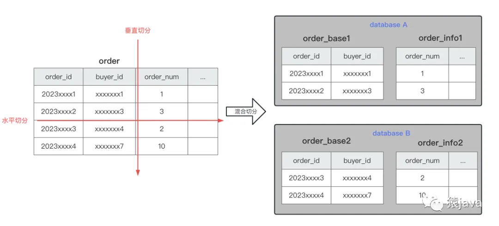

## MySQL

1.  Mysql为什么用B+树，B+树和B树，红黑树等有什么区别

    Mysql选择B+树（多路平衡查找树）作为索引结构的主要要是因为B+树在数据库场景下具有显著的性能优势：
    - **更适合磁盘存储**：B+树内部节点不存储数据，这样能放下更多的索引项，树的高度更低，且这样一次查询所需的I/O次数更少，叶子节点存储实际数据，且叶子节点是连续的，使得范围查询非常高效。而B数每个节点都可能存储数据，数据分布较为分散。
    - **查询性能较为稳定**：所有查询都需要达到叶子节点，路径长度一致
    - **更适合数据库场景特性**：通常数据库需要处理大量数据；经常进行范围查询；对磁盘I/O敏感

    总结回答：MySQL使用B+树作为索引结构，主要是因为它在数据库场景下非常合适。首先，B+树的内部节点不存储实际数据，只存储键值，这样能放下更多的索引项，树的高度更低，磁盘I/O次数也会减少。其次，所有数据都存储在叶子节点中，并且叶子节点通过链表顺序连接，这让范围查询和排序非常高效，最后B+树的查询性能比较稳定，因为所有查询必须走到叶子节点，避免了性能波动。

    B+树节点示例结构
    ```
    class BPlusTreeNode{
        int[] keys;
        BPlusTreeNode[] children; // 孩子节点
        BPlusTreeNode next; // 兄弟节点（指向下一个叶子节点）（B树则缺少此属性）
        Object[] values; // 叶节点实际数据存储 （B树会在内部节点也存储实际数据）
        int keyCount;
        boolean isLeaf; // 是否叶子节点
    }
    ```
    | 特性     | B 树                       | B+ 树                        |
    | ------ | ------------------------- | --------------------------- |
    | 数据存储位置 | 数据和索引都可以存储在内部节点和叶子节点中     | 只有叶子节点存储数据，内部节点只存储键值        |
    | 树高     | 相对较高，因为内部节点也存放数据，能存的索引项较少 | 树更矮，内部节点纯索引，能存更多 key，减少 I/O |
    | 查询路径   | 查询可能在中间节点结束（不一定到叶子节点）     | 所有查询都必须走到叶子节点，查询路径稳定        |
    | 范围查询   | 需要中序遍历，效率低                | 叶子节点有链表顺序连接，范围查询非常高效        |
    | 磁盘利用率  | 较低，内部节点混合存储数据和索引，能存的索引少   | 较高，内部节点全是索引，一个节点能存更多 key    |
    | 适合场景   | 内存型数据结构（如部分内存索引场景）        | 数据库、文件系统这种需要大规模磁盘存取的场景      |


    B+树相对于B树的区别：
    - **数据存储位置不同**：B+树所有数据都存储在叶子节点上，而B树每个节点都可能存储数据
    - **叶子节点是否连续**：B+树的叶子节点时连续的，是一个有序链表结构；而B树叶子节点不一定连续
    - **性能**：B+树范围查询比较高效，且插入删除因为都在叶子节点，所以较简单 
    - 相同点：他们都是多路平衡查找树

    B+树与红黑树的区别：
    - 结构上B+树是多路平衡树，红黑树是二叉平衡树。而且红黑树也是在每个节点都可能存储数据，相对也是不怎么高效。
    - B树和红黑树都更适合在内存中使用，因为其高效简单的插入删除操作。（Redis早期版本使用了红黑树作为ZSet的底层数据结构，但基于更简单且性能接近的原因，在Redis5.0+的ZSet都不再直接依赖红黑树）

    补充：InnoDB B+树高度通常是3 ~ 4层，3层已能覆盖千万 ~ 上亿级别数据，4层覆盖几十亿的级别。

    以 InnoDB 为例：

    每个页大小是 16KB。每个B+树的节点对应一页（设计如此，主要是基于磁盘和内存建的数据交换是页单位的，这样索引节点设计为“1节点 = 1页”，避免访问索引时产生额外I/O）。

    假设主键类型BIGINT 占 8B，指针占 6B，算上额外开销，每个内部节点大约能存 16 * 1024 / 14 ≈ 1200 个 key。

    假设一条记录大小 1KB，一个叶子节点（页）能存 ≈ 16 条记录。

    那么：

    高度 2 的 B+ 树，可以容纳 ≈ 1200 × 16 = 2 万条记录。

    高度 3，可以容纳 ≈ 1200² × 16 = 2300 万条记录。

    高度 4，可以容纳 ≈ 1200³ × 16 = 28 亿条记录。

    所以在真实业务里，即使几千万行数据，B+ 树高度也就 3-4 层，一次查询只需 3~4 次磁盘 I/O，非常高效。


2.  Varchar和Char
    Char和Varchar都是mysql中常见的字符串数据类型。
    
    - Char是固定字符串，使用时必须指定长度，例如Char(10)，表示该字段最多存储10个字符，如果实际存储长度小于声明长度，mysql会在末尾填充空格。而Varchar是可变长度，虽然也必须指定长度，但是实际存储的字符串长度可以小于声明长度，mysql会根据实际存储长度动态分配空间。

    - 性能上由于Char是固定长度，因此读取速度更快，因为mysql可以直接知道存储的起始位置；相对地Varchar则由于是可变长度，mysql需要根据长度信息来定位起始位置，读取速度相对慢一些。

    - 因此Char更适合存储固定长度的字段，例如固定长度标识符、手机号等；而Varchar更适合存储不固定的长度，例如输入文本、描述信息等。


3.  InnoDB和Myisam的区别
    InnoDB和MyISAM是MySQL数据库中两种常用的存储引擎。有以下区别：
    - **事务支持**：InnoDB支持事务处理（ACID即原子性、一致性、隔离性、持久性），提供行级锁定，适合一些需要事务的支持的场景，且支持回滚、提交和崩溃恢复能力，保证数据的完整性和一致性。而MyISAM则不支持事务，需要应用程序逻辑来支持数据完整性
    - **锁机制**：InnoDB使用行级锁定，多个用户可以同时对不同行进行操作，减少锁竞争，且支持多版本并发控制（MVCC），提高了并发性能；MyISAM使用表级锁定，整个表在读写期间被锁定，适合读多写少的场景，锁竞争可能会带来性能瓶颈。
    - **数据完整性**：InnoDB支持外键约束，可以维护表之间的关系，支持自动恢复和崩溃后恢复，保证了系统故障时的一致性。而MyISAM则不支持外键，也没有自动恢复机制，数据在系统故障后会出现不一致。
    - **性能**：InnoDB适合写密集和事务处理的场景，而且走了内存管理优化，提供缓冲池，提高了数据读取性能；而MyISAM适合读密集的应用场景，表级锁定在读取时性能比较高。
    - **存储结构**：InnoDB使用聚集索引，主键索引和数据存储在一块，提高主键查询性能，支持全文索引，性能相对较高；而MyISAM使用非聚集索引，数据和索引分开存储，也支持全文索引，但是性能不如InnoDB。
    - **适用场景**：InnoDB适用于需要事务支持、高并发写操作和依赖数据完整性的应用场景，例如电商、金融等；而MyISAM适用于读密集型场景，例如博客、新闻类。

    总结：InnoDB 和 MyISAM 最大的区别在于事务和并发控制。InnoDB 支持事务，具备提交、回滚和崩溃恢复能力，保证了数据的完整性和一致性；而 MyISAM 不支持事务，崩溃后只能依赖工具修复。并发方面，InnoDB 支持行级锁和 MVCC，能在高并发读写场景下保持性能；MyISAM 只支持表级锁，并发能力差。除此之外，InnoDB 还支持外键约束，而 MyISAM 不支持。总体来说，InnoDB 更适合核心业务表和高并发写入的场景，而 MyISAM 适合读多写少、不要求事务的场景，比如日志和报表。

4.  Mysql索引的数据结构和原理，索引优化，索引失效的条件，索引下推

    MySQL使用B+树作为其索引结构，是B树的一种变种，具有以下特点：
    - 多路查找树：B+树每个节点下有多个子节点，适合磁盘I/O操作
    - 顺序存储：所有叶子节点按顺序连接，便于范围查询
    - 高度平衡：无论插入还是删除，B+树始终保持稳定，确保查询效率稳定
    - 数据存储位置：实际的数据仅存储在叶子节点，而非内部节点
    
    MySQL不选择其他数据结构的原因分别如下：
    - 哈希：链式哈希解决哈希冲突的话，无法实现高效的范围查询
    - 二叉查找树：即右大于根，左小于跟的二叉树，会出现极限情况下退化成链表的情况
    - 红黑树：在二叉查找树的基础上增加节点自旋和调整，使得二叉查找树保持平衡，在顺序插入时还是会出现右倾的情况
    - AVL树：绝对平衡二叉树，虽然不存在右倾的问题，但是一个节点只能存储一个数据，磁盘I/O次数会比较多
    - B树：B树是相对较高效的结构，已经能尽可能地减少磁盘I/O了
    - B+树：仅在叶子节点存储数据，其他内部节点存储索引，单节点也能存很多索引数据，使得树的高度降低，并且叶子节点通过链表结构有序连接，便于范围查询。

    InnoDB索引原理:

    InnoDB是聚集索引方式，即数据行和索引键同页存储，首先建表时InnoDB会根据主键建立主键索引B+树

    主键索引树中内部节点存的都是key，例如主键字段Id和对应的值，在叶子节点存储的是主键ID对应的数据，比如在select * from user_info where id = 15，InnoDB就会根据id主键来查找主键索引树。

    如果为表里其他字段增加了索引，那InnoDB会根据该字段例如user_name来创建辅助索引树，辅助索引树中内部节点存的是该字段user_name和对应的值，在其叶子节点中存的是主键KEY，查找时，先查辅助索引树，找到主键KEY后，再根据主键KEY查找主键索引树拿到对应的数据。

    也就是说只有主键索引树存了具体的数据，其他索引树都不存储具体数据，而是存主键key，主要是为了节省存储空间，一个表中可能会有多个索引，如果每个索引树都存了具体数据，表的索引数据文件就会变得非常大，从节约磁盘空间角度来说，确实没有必要每个索引树都存储具体数据。（该过程也被称为回表）

    总结回答：InnoDB索引底层是B+树，分为聚簇索引和二级索引，表数据本身就是一棵聚簇索引B+树，叶子节点存储整行数据，一个表只能有一个，一般就是主键索引，按主键查询的时候只需要在这颗树里定位即可。第二类是二级索引，它的叶子节点不存储整行数据，而是存储对应的主键值。所以通过二级索引查询时，需要先找到主键，再回表到聚簇索引获取完整数据，这个过程是回表，当然如果查询的列正好都在二级索引里，就不需要回表了，回表设计主要是为了节省空间、维护成本和保证一致性。

    聚集索引和非聚集索引：
    - InnoDB中聚集索引是主键索引，辅助索引都是非聚集索引。
    - 聚集索引是数据行和索引键同页存储，而非聚集索引叶子节点存的是主键值和指针
    - 从查询效率上讲，聚集索引单词I/O即可直达数据行，而非聚集索引则需要回表查询
    - 聚集索引唯一，非聚集索引可重复

    索引设计的黄金法则：

    1. 最左匹配原则：最左匹配原则是指在使用联合索引时，MySQL会根据索引中的字段，从左到右依次匹配查询条件中的字段，最左匹配原则会一直往右匹配，直到遇到范围查询（例如>,<）为止，范围查询这一列会用到，但是后面的不会用到了，但是遇到>=,<=或者BETWEEN及前缀匹配LIKE时，是不会停止匹配的。最左匹配原则如果遇到跳过前列直接使用后列的会失效，例如联合索引（col1，col2，col3）,where条件是：where col2 = ？，这种会失效，但是如果交换了顺序，例如where col2 = ？ and col1 = ？，遇到这种情况，MySQL的查询优化器分析SQL语句时，会对查询条件做重排序，以便用到索引。

    例如
    ```
    CREATE TABLE user (
    id INT PRIMARY KEY,
    name VARCHAR(50),
    age INT,
    INDEX idx_name_age (name, age)
    );
    SELECT * FROM user WHERE name LIKE 'J%' AND age=20;
    ```
    用到联合索引了吗？答案是用到了联合索引，但是遇到范围like匹配后就停止了，所以只用到了name列，没有用到age列。

    这行查询在5.6引入索引下推时做了优化，虽然遇到了like的范围查询，但是存储引擎发现age列也是索引里有的列，所以在扫描索引行时，就直接检查age=20？不符合的就直接丢掉，减少了回表次数.

    索引优化的常用方法：

    1. 合理选择索引列，例如索引建在值选择性高的列；针对查询频率较高的列优先创建索引。
    2. 使用联合索引，建联合索引时以最左匹配原则来合理排序
    3. 查询时避免索引失效，例如查询条件避免函数使用，避免子查询，避免非前缀匹配，避免在索引列出现NULL值，避免出现隐式类型转换（当操作符左右两边的数据类型不一致时，会发生隐式转换）等
    4. 使用覆盖索引，尽量将查询字段完全包含在索引中，避免回表操作 
    5. 定期维护、重建索引，避免碎片化。重建索引通常是为了解决B+树页碎片、统计信息不准或空间浪费的问题。在InnoDB里可以先删除再新建（DROP INDEX 再 ADD INDEX）或者重建整张表，通过ALTER TABLE t_name ENGINE=InnoDB;


    索引下推：
    索引下推，简称ICP，指的是MySQL提供的一项索引优化功能，**通过将部分查询条件推送到存储引擎层，减少回表操作次数**，**本质上是在索引扫描阶段就过滤掉不符合条件的记录，必须基于索引，如果查询条件不在索引列则不会生效。**提高查询性能。ICP适用于非聚簇索引和复杂查询条件，可以显著减少存储引擎层和server层之间的数据传输量。

    

    ICP 工作原理：

    ICP通过将部分where查询条件推送到存储引擎层，让存储引擎层在遍历索引时直接过滤掉不符合条件的记录，从而减少回表次数。详细步骤如下：
    1. 查询优化器分析，哪些条件可以推送到存储引擎层
    2. 推送：查询优化器可以利用索引的条件推送到存储引擎层；存储引擎层在遍历索引时，会根据推送的条件先过滤掉不符合的记录。
    3. 回表：过滤后的记录再进行回表操作，获取完整数据行。这时记录已被过滤，回表次数将大大减少。

    ICP适用场景：

    - 非聚簇索引
    - 复杂查询条件中用到索引的部分查询子句

    索引下推不一定是索引失效时才会生效，重点应该放在减少回表次数，例如以A、B两列建索引，查询条件为where A = 1 and B = 3，如果没有索引下推，那需要先查找到A = 1的记录范围，然后把对应的主键取出后，再回表查询这些记录并判断 B = 3是否成立。而启用了索引下推后，那在存储引擎层就会把不满足 B = 3 的条件过滤掉，减少回表的记录数。

5.  数据库Join的原理（Nested Join, Nested index Join, Hash Join等）
    join语法：SELECT * FROM A JOIN B ON A.id = B.id
    MySQL中会根据表的大小、索引情况和查询条件，查询优化器会选择不同的JOIN算法来执行表连接操作。

    - **Nested Loop Join算法（嵌套循环连接）**： 最基本的连接算法，通过两层for循环来完成join，先遍历第一个表，对外层循环中的每一行，遍历第二个表，检查是否存在满足连接条件的行。多适用于小表的连接或者是join条件的列没有索引时，默认会选择Nested Join。时间复杂度O(m * n)
    - **Nested Index Loop Join算法（索引嵌套循环连接）**：索引嵌套循环连接是Nested Join的优化版本，利用索引来加速内存循环的查找，在遍历第二个表时，利用索引来快速查找满足连接条件的行。这种适用于join条件的列有索引的情况，时间复杂度O(m * log n)
    - **Hash Join算法（哈希连接）**：哈希连接是一种高效的连接算法，适用于大表间的连接，缺点可能会存在哈希冲突过多导致的性能问题，它通过哈希表来加速查找，首先选择较小的表，逐行遍历该表，将join条件列作为key，行的指针作为value，构建哈希表；然后遍历较大的表，对于每一行，计算连接列的哈希值，查找哈希表，找到匹配的行。时间复杂度O(m + n)
    - **Sort-Merge Join算法（排序-合并连接）**：这是一种适用于有序数据的连接算法，通过先排序再合并的方式来实现，先将两个表的join条件列排序，再用双指针分别遍历两个表，逐行比较join条件列的值，最终找到匹配的行，时间复杂度O(mlogm * nlogn)
    - **Block Nested Loop Join算法（块嵌套循环连接）**：分块处理，将大表分成多个块，每个块可以放入内存，然后双层for循环，先遍历小表，然后对小表每一行，遍历当前块中的行，匹配到满足join条件列的数据，适用于当数据表特别大，没法完全放入内存时的操作，时间复杂度O(m * n)

6.  redo log的作用，buffer pool的原理，redo log刷盘的时机，redo log满了怎么办处理，为什么用redo log而不是bin log恢复数据
    
    redo log是InnoDB存储引擎的日志文件，用于记录事务操作的变化，确保在数据库崩溃后需要恢复数据时，能够通过读取redo log二进制文件完成数据恢复，确保数据的一致性。

    buffer pool是InnoDB的内存区域，用于缓存数据页和索引页，减少磁盘I/O操作。通过将频繁访问的数据页保留在内存中，减少对磁盘的操作，能显著提高查询和更新的性能。

    buffer poll工作原理是先将数据页加载到内存中，在查询或修改时，先检查buffer poll中是否存在所需的数据页，不存在的话则从磁盘读取加载到buffer pool，然后对这些内存中的数据页利用LRU算法来管理，对修改后的数据页（脏页）通过后台线程定期写入到磁盘，确保数据一致性。

    redo log刷盘常见的时机场景如下：
    - 事务提交时，通过配置innodb_flush_log_at_trx-commit=1来控制这一行为，当事务提交时InnoDB会确保redo log已经写入到磁盘。
    - 后台线程定期同步，InnoDB的后台线程会定期同步redo log刷盘，通常是每秒执行一次。
    - buffer pool脏页刷新，当buffer poop脏页刷新到磁盘时，相关的redo log也会被同步到磁盘
    - checkpoint操作，在执行checkpoint操作时，InnoDB会将redo log内容同步到磁盘中。
    - 系统崩溃时，InnoDB也会尝试做redo log刷盘。
    
    redo log的日志文件形式是一个循环日志文件组，类似于唤醒数组，从头开始写，写到末尾后又从头开始。当日志文件组写满之后，MySQL会利用checkpoint机制将脏页写回磁盘，并更新redo log checkpoint位置。

    为什么使用redolog恢复数据而不是binlog？

    这是因为redolog记录的是物理数据页的修改，恢复数据时可以直接应用redolog，不需要解析sql，恢复效率高；而binlog都是逻辑日志，可以理解为记录的都是sql语句，如果用binlog还需要解析执行sql语句，效率低。
7.  redo log, undo log, bin log的原理和作用

    redo log(重做日志)、undo log(回滚日志)、bin log(归档日志)是MySQL中的比较重要的几个二进制日志

    **redo log（重做日志）**
    - redo log是InnoDB存储引擎的日志文件，又称作重做日志文件，用于记录事务操作的变化，记录的是数据页修改之后的值，用于在数据库崩溃后恢复数据，确保数据的一致性。
    - 写入时机：理想情况下，每次事务对数据页进行修改时，都会生成redo log，
    - 持久化：redo log是持久化的，及时数据库崩溃，这些日志也会保留在磁盘上
    - 先明确MySQL中是以页为单位，查询记录时，会从硬盘把一页的数据加载出来，放到Buffer Pool（数据页缓冲池）中，后续的查询更新都是先从Buffer Pool中找，如果没命中再去硬盘加载，减少磁盘I/O开销。更新的时候，会把在“什么数据页上做了什么修改”记录到redo log buffer中，接着刷盘到redo log文件里。
    - Redo log的写入流程： 
        - 事务执行，修改Buffer Pool。InnoDB会先在Buffer Pool中找到id为1的数据对应的数据页，然后修改此数据行，此时该页变成“脏页”，然后生成一条redo log记录，写入到redo log buffer中。
        - 事务提交，触发刷盘。事务提交时，InnoDB会根据innodb_flush_log_at_trx_commit参数配置的刷盘策略决定是否将redo log buffer刷入磁盘（这一步是保证持久性的关键）
        - 当脏页达到阈值或者事务提交时，InnoDB会将脏页数据写入到数据文件，但是刷盘前必须确保该页对应的redolog已落盘，否则数据崩溃回复数据时会丢失数据。
        - 刷盘策略：innodb_flush_log_at_trx_commit取值0（延迟写）,1（实时写，实时刷）,2（实时写，延迟刷），只有当1时，每次事务提交都会刷盘，这样才不会丢失任何数据，
        - 另外InnoDB引擎有一个后台线程，每隔1秒，就会把redo log buffer中的内容写入到文件系统缓存，然后调用fsync刷盘。也就是说 如果一个没有提交事务的redo log记录，也可能会刷盘，因为redo log是需要写入到redo log buffer中的，写入到redo log buffer时实际事务还没及提交，而InnoDB的后台线程每隔1秒扫描一次，因此会redo log buffer中的redolog记录会被后台线程扫描刷盘。
        - 刷盘时机还要面临其他情况。例如redo log buffer空间占用即将达到阈值，也会触发刷盘；关闭服务器时触发刷盘；定期执行checkpoint检查点操作触发刷盘等。
        - 当事务执行期间，MySQL挂了或者宕机了，这部分日志丢了，但是事务没有提交，所以日志丢了也不会有损失。
        - redo log记录的不是完整数据页，而是表空间号、数据页号、磁盘文件偏移量、更新值等，所以相对于数据页刷盘性能更好，如果每次都用完整数据页刷盘，在只更新某一行数据时，就得刷盘整个数据页，比较浪费、耗时。

    **Bin log（归档日志）**

    Bin log是逻辑日志记录，记录内容是语句的原始逻辑，可以直接看做是原来SQL语句，只不过将SQL语句翻译了下，属于是MySQL中的server层。不管底层是什么引擎，只要发生了数据更新，都会产生bin log日志。

    另外，相对于redo log的循环写+覆盖的方式，bin log是通过追加的方式来写入的，可以通过max_binlog_size来设置每个binlog日志文件大小，当大小超过给定值后，会生成新的文件来保存。

    Bin log主要使用场景有两个，主从复制和数据恢复。
    - 主从复制，从Master端开启bin log，然后将bin log发送到各个slave端，slave端重放bin log实现主从数据一致。
    - 数据恢复，通过使用```mysqlbinlog```工具来恢复数据。

    bin log的写入时机也非常简单，事务执行过程中，先把日志写到bin log cache中，事务提交时，再把binlog cache写入到binlog文件中。可以通过设置sync_binlog参数来控制，同样地当sync_binlog=1时，代表每次事务提交都执行fsync刷盘。

    redo log和bin log虽然都属于数据库事务持久性的保证，但是写入时机是不同的，redolog在事务执行过程中可以不断写入，而binlog只会在事务提交时写入，如果redolog日志写入后，binlog日志写入期间发生了异常，这时候就会出现两份日志记录的数据不一致的情况。

    为了解决这一问题，InnoDB引擎使用了**两阶段提交**方案。

    将redolog的写入拆成了两个步骤 prepare和commit，这就是两阶段提交。在prepare阶段，将redolog中的事务状态设置为prepare，然后将redolog持久化到磁盘中。在commit阶段，将binlog持久化到磁盘中，并且根据事务id将对应的redolog设置为commit状态。

    在异常情况下，不论是redolog已经写入但binlog未写入，还是binlog和redolog都写入，但都处于prepare状态，此时redolog都处于prepare状态。
    
    MySQL重启时，会按顺序扫描redolog，碰到处于prepare状态的redolog时，会拿着事务id去binlog中查看是否存在此事务id，如果没有，说明是redolog写入了，但binlog写入时异常了，如果有，就说明两者都写入刷盘了，但是两者都没有commit。
    
    对于处于prepare状态的redolog，既可以提交事务，也可以恢复事务，这取决于在binlog中是否能找到对应的事务id，如果有就提交事务，没有就回滚事务，这样就可以保证两份日志的一致性了。

    当然，两阶段提交方案也是有缺点的，一是磁盘I/O次数高，如果innodb_flush_log_at_trx_commit=1和sync_binlog=1的设置参数，每次事务提交都会有两次刷盘。另外一个确定就是锁竞争激烈，两阶段提交方案虽然能保证单事务两个日志的一致性，但是在多事务时无法保证两者提交顺序一致，因此需要加锁来保证多事务下的日志提交顺序一致性。
    
    因此又有了新的优化方案：**组提交** 当有多个事务提交时，会将多个binlog刷盘操作合并成一个，从而减少磁盘I/O次数，然后将原来两阶段中的commit阶段，分为三个过程：flush、sync、commit，每个阶段都有加锁保证事务写入顺序。


    **undo log（回滚日志）**

    每个事务对数据的修改都会被记录到undo log中，当执行事务过程中出现错误或者需要执行回滚操作时，MySQL可以利用undo log将数据恢复到事务执行之前的状态。

    undo log属于逻辑日志，例如执行一条delete语句后，undo log都会记录一条相对应的insert语句。同时undo log的信息也会被记录到redo log中，因为undo log也要实现持久性保护，知道没有事务需要它，undo log本身是会被删除清理的，例如insert操作，在事务提交之后就可以清除了；update/delete操作在事务提交后不会被立即清除，而是添加到history list中，由后台线程purge进行清理。

    undo log适用场景：
    - 事务回滚，在事务需要回滚时，undo log用于撤销事务对数据页的修改，确保数据一致性。
    - 多版本并发控制（MVCC）：undo log用于实现多版本并发控制，允许事务读取数据的旧版本记录，而不被其他事务的修改影响。

8.  4个隔离级别的原理，分别怎么实现的。MVCC的原理，next-key-lock如何解决幻读（有没有例外情况）

    MySQL有四个事务隔离级别，分别是：READ UNCOMMITTED(读未提交)，READ COMMITTED(读已提交)，REPEATABLE READ(可重复读，MySQL默认隔离级别)，SERIALIZABLE(可串行话)。每种隔离级别通过不同的机制来控制并发事务之间的可见性和冲突。

    - **READ UNCOMMITTED（读未提交）**

    原理：事务可以读取其他事务尚未提交的数据，即“脏读”，在READ UNCOMMITTED级别下，事务不会对读取的数据进行任何锁操作，也不会使用多版本并发控制（MVCC），这意味着一个事务可以看到其他事务尚未提交的修改。

    缺点：这种隔离级别数据一致性太弱，可能会导致脏读、幻读、不可重复读

    实现：事务对当前读取的数据都不加锁，都是当前读（读取数据最新提交版本）

    - **READ COMMITTED（读已提交）**
    原理：允许读取并发事务已经提交的数据，在READ COMMITTED级别下，读操作会使用行级锁，确保读取数据是已提交版本；使用MVCC多版本并发控制，为每个查询生成一个快照，确保读取数据是一致的。即通过行级锁+MVCC来避免脏读的问题

    缺点：可以避免脏读，但是幻读和不可重复读的问题仍有可能发生。不能避免不可重复读的问题主要是由于快照生成时间是每次select新建，同个事务多次select就会有多个快照

    实现：事务对当前读取的事务不加锁，都是快照读（即MVCC为每个事务开始时生成一份数据快照，读取从数据快照读）；而事务在更新某数据的瞬间，先对其加*行级排他锁*，直到事务结束释放


    - **REPEATABLE READ（可重复读）**
    原理：对同一字段的多次读取结果都是一致的。事务在读取数据时，会使用快照读（即使用MVCC为每个事务生成一个快照，确保整个事务期间数据读取时一致的），避免不可重复读的问题。很大程度上解决了幻读的问题。

    实现：对普通select语句用快照读，对更新数据的操作使用加*Next-key-lock(结合行级锁和间隙锁)*锁定扫描到的记录及记录之间的范围（间隙）防止其他事务在这个范围内插入或删除数据，从而避免幻读，直到事务结束释放，通过间隙锁在这个级别就已经很大程度上解决了幻读问题。

    - **SERIALIZABLE（可串行化）**
    
    最高的事务隔离级别，所有事务逐个依次执行，这样事务之间就完全不会产生干扰，该级别可以完全解决脏读、不可重复读、幻读的问题

    实现：读取数据时，先对其加行级共享锁，知道事务结束释放，都是当前读；更新数据时，先对其加表级排它锁，知道事务结束释放

    - **脏读、不可重复读、幻读**

    脏读：是指一个事务A读取到了另一个事务B未提交的数据，假如另一个事务B这时发生了回滚，那A事务读取到的就是不存在的数据，也就是发生了脏读

    不可重复读：是指同一个事务在多次读取同一行数据时，得到了不同的结果，这时因为在两次读取之间，有另一个事务对该行数据做了修改或删除操作。例如：事务A第一次读取了表中年龄的数据，这时事务B修改了改行数据，事务A再次读取，两次读取结果不一致。这就是不可重复读

    幻读：是指一个事务在执行多次相同条件查询时，发现*结果集中出现了新的“幻影”行*，也就是说记录的数量发生了变化，通常是因为另一个事务B在两次相同条件查询期间插入或删除了数据。

    **MVCC实现原理**

    MVCC的实现是通过保存数据在某个时间点的快照来实现的，每个事务读取到的数据都是一个历史快照，称为*快照读*，不同于*当前读*，*快照读*读到的数据可能不是最新的，但是快照隔离能使得整个事务看到的数据都是事务开始时的数据状态。而写操作不覆盖已有数据项，而是创建一个新的版本，知道所在事务提交才变为可见。

    InnoDB实际实现时，会在每行数据后添加额外的隐藏的事务版本号来实现MVCC，每开启一个新的事务，事务的版本号就会递增，虽然每行记录都需要额外的存储空间和维护工作，但是可以减少锁的使用，读数据性能很好。例如在select时，只会读取版本号<=当前事务版本号的记录，insert时保存当前事务版本号作为行创建版本号，delete时，保存当前事务版本号作为行删除版本号，

    **Next-key-lock（行锁+间隙GAP锁）**：
    行锁可以防止别的事务修改或删除数据；GAP锁防止别的事务新增，行锁和GAP锁结合形成的Next-key-lock共同解决了RR级别下的幻读问题

    InnoDB中的间隙锁是在索引B+树的基础上，利用索引记录的顺序关系，确定加锁的*间隙*范围，从而对这个范围内的*间隙*加锁。

    Next-key Lock的有效性高度依赖索引的正确使用，当索引使用不当或存在问题时，Next-key Lock可能无法正常工作，可能导致幻读问题，例如事务中的查询使用!=、使用函数等，会造成Next-key Lock无法精确控制锁定范围，进而可能导致锁范围扩大、并发性能下降或数据一致性问题


9.  行锁，表锁，意向锁
    
    行锁是对表中的单行或者多行数据加锁，锁定期间其他事务不能对被锁定的行记录进行读写操作。这种锁粒度小，并发度高，仅锁定部分行，不同事务之间可以同时对不同行进行操作，缺点是实现复杂，开销大，容易出现死锁。

    表锁是对整个表进行锁定，锁的粒度大，实现简单适合对表进行批量操作，缺点是并发性能差，容易导致锁冲突。

    意向锁是一种辅助锁，用于表示事务对表中的某一行或多行数据记录有锁定意图，本身并不直接锁定数据，而是优化锁的管理。分为意向共享锁和意向排它锁。意向锁的存在可以减少锁的冲突，提高并发性能。


10. 主从架构的各种问题（主从延迟的解决方法，缓存一致性问题）
    **CAP法则（Consistency一致性、Availability可用性、Partition Tolerance分区容错性）**
    
    CAP法则指的分布式系统设计的重要理论，在分布式系统中，最多能同时满足CAP三个特性中的两个

    主从架构下的**主从复制**过程：
    1. 写入binlog，主库更新本地存储数据，写入binlog日志文件，然后提交事务
    2. 同步binlog，从库得到binlog日志发生变化的通知后，从库拉取数据
    3. 回放binlog，从节点请求拿到binlog数据后，写入到relay-log中继日志后，返回复制成功的响应给主节点；从节点监听到relay-log变更，开始读取日志记录，回放binlog更新从节点数据，实现主从数据一致性。

    主从同步延迟通常是由主库与从库之间的网络延迟、从库处理能力、主库写操作量等因素造成，长时间的同步延迟可能会影响系统的数据一致性。
    
    一般可以通过执行show slave status，看关键字段：Second_behind_master标识落后主库的秒数，Slave_IO_running和Slave_SQL_running标识I/O线程和sql线程是否正常执行

    处理方法一般有：
    1. 优化主库性能，增加主库硬件资源（增加CPU内存硬盘）优化SQL语句避免拖累数据库性能
    2. 优化从库性能，从库性能直接影响到主从同步的速度，同样也可以优化从库的查询
    3. 对于从库，可以调整相关MySQL配置，例如调整innodb_buffer_pool_size增加InnoDB缓存大小，启用多线程复制
    4. 监控和自动化处理。使用监控工具持续跟踪复制延迟，及时发现问题，另外也可以采取一些自动化工具（MHA、Orchestrator）处理

    **缓存一致性问题一般是指数据库和缓存数据不一致的情况**，解法：

    一般可以采取先操作数据库再删除缓存，不推荐先删除缓存在操作数据库，这样一是导致并发情况下其他线程在缓存中发现没数据后，直接取读数据库，除了数据不一致外，还可能会造成缓存击穿导致数据库崩溃。

    先操作数据库再删除缓存是相对影响更小的方案，如果第二步（删除缓存）出现失败的情况，可以采用重试机制（例如删除失败发MQ消息不断重试删除缓存，知道删除成功或重试5次）来解决。

    - **延迟双删策略**，有两种实现方式，同样都是删两次缓存，主要是先删缓存，还是先删数据库的区别。
    
    延迟双删是一致性相对更高一些的方案。
    
    先删除缓存，再更新数据库，延迟一段时间间隔（例如1s），再删除缓存。这样是为了将1秒内所造成的缓存脏数据再次删除

    - 删除缓存后到写数据库之前，读请求可能会访问到旧数据，虽然再次删除缓存会解决，但是这块时间间隔内读的都是脏数据
    - 极端情况特殊场景下，访问到脏数据的线程，在第二次删缓存之后，又更新了缓存，会造成后续请求读缓存和数据库不一致。
    - 但是也会存在间隔的时间不好把握的问题。

    先更新数据库，再删缓存，延迟一段时间后再删一次缓存。更容易保证数据一致性。

    - 最终的延迟删除缓存可以确保最终的数据一致性
    - 可能会造成数据库的压力，因为在删除缓存和重新加载缓存期间，所有读请求都会直接访问数据库


    延迟双删已经是数据一致性相对较高的方案了，如果还需要进一步保证（例如确保第二部删除缓存一定要成功），可以采用*异步监听binlog + 可靠消息+重试机制*，这种方案也有问题：脏数据时间窗口较大（从监听到发mq到消费mq耗时可能会较长，这段时间是可能的脏数据窗口，极端场景下可能出现canal组件宕机）

    1. 更新数据库后不做操作
    2. Canal等组件监听binlog发现有更新后就发可靠MQ删除缓存
    3. 如果删除缓存失败，就基于手动ack、retry等机制，让消息在优先次数之内不断重试。

    补充：Canal是阿里开源的中间件，模拟 MySQL 主从复制的交互协议，把自己伪装成一个 MySQL 的从节点，向 MySQL 主节点发送 dump 请求，MySQL 收到请求后，就会开始推送 Binlog 给 Canal，Canal 解析 Binlog 字节流之后，转换为便于读取的结构化数据，供下游程序订阅使用。

    https://zhuanlan.zhihu.com/p/651106152
    
    以下是从知乎上复制过来的，参考学习：

    参考知乎上分享的生产可用的解决方案：**缓存三重删除 + 数据一致性校验 + 更新流程禁用缓存 + 强制读Redis主节点**
    整体流程图：
    
    整体方案如下：
    - 更新数据库同步删除缓存；该业务缓存key加“禁止名单” + AOP注解在写操作前拦截 + 事务提交后同步删除缓存。这里禁用缓存标识可以结合缓存Key设计：判断是否进入“禁止名单”；涉及更新方法时加注解拦截写操作
    - 监听数据库的binlog异步删除缓存；通过中间件抓取binlog，并投递到MQ；缓存管理服务消费MQ并结合重试机制，保障一定会最终删除成功（核心）
    - 缓存数据带过期时间，过期后自动删除，越近更新的数据过期时间越短
        - 主要用于进一步防止并发下的脏数据问题
        - 解决一些由于未知情况，导致需要更换缓存结构的问题
    - 监听数据库的binlog延迟N秒后进行数据一致性校验 （核心）
        - 缓存管理服务经过异步删除缓存后，发送一条延迟消息，可由缓存管理服务自身消费；
        - 消费者执行一致性校验，对DB最新值和缓存key做校验，不一致的话，则删除缓存或者修复缓存（尽量不要做修复，可能会有多个请求时的时序问题）。 
    - 解决一些极端场景下的脏数据问题
    - 存在数据库更新的链路禁用对应缓存
        - 防止并发下短期内的脏数据影响到更新流程
    - 强制读Redis主节点
    - 异步查询数据一致性校验，对比数据库查询得到的值和缓存值，将结果进行打点统计，看数据校验不一致率有多少，如果超过1%，可能流程有问题，需要进一步排查优化。如果低于0.01%，那基本就没啥问题了。 （监控设施）

    缓存和数据库一致性保障方案，目前网上的资料大多是类似于方案3，如果你能在面试中说出我给的这个方案，相信可以让面试官眼前一亮，这其实就是你的加分项，可以帮助你从众多候选人之中脱颖而出。

    1、想要提高应用的性能，可以引入「缓存」来解决

    2、引入缓存后，需要考虑缓存和数据库一致性问题，可选的方案有：「更新数据库 + 更新缓存」、「更新数据库 + 删除缓存」

    3、更新数据库 + 更新缓存方案，在「并发」场景下无法保证缓存和数据一致性，解决方案是加「分布锁」，但这种方案存在「缓存资源浪费」和「机器性能浪费」的情况

    4、采用「先删除缓存，再更新数据库」方案，在「并发」场景下依旧有不一致问题，解决方案是「延迟双删」，但这个延迟时间很难评估

    5、采用「先更新数据库，再删除缓存」方案，为了保证两步都成功执行，需配合「消息队列」或「订阅变更日志」的方案来做，本质是通过「重试」的方式保证数据最终一致

    6、采用「先更新数据库，再删除缓存」方案，「读写分离 + 主从库延迟」也会导致缓存和数据库不一致，缓解此问题的方案是「延迟双删」，凭借经验发送「延迟消息」到队列中，延迟删除缓存，同时也要控制主从库延迟，尽可能降低不一致发生的概率后记

    本以为这个老生常谈的话题，写起来很好写，没想到在写的过程中，还是挖到了很多之前没有深度思考过的细节。

    在这里我也分享 4 点心得给你：

    1、性能和一致性不能同时满足，为了性能考虑，通常会采用「最终一致性」的方案

    2、掌握缓存和数据库一致性问题，核心问题有 3 点：缓存利用率、并发、缓存 + 数据库一起成功问题

    3、失败场景下要保证一致性，常见手段就是「重试」，同步重试会影响吞吐量，所以通常会采用异步重试的方案

    4、订阅变更日志的思想，本质是把权威数据源（例如 MySQL）当做 leader 副本，让其它异质系统（例如 Redis / Elasticsearch）成为它的 follower 副本，通过同步变更日志的方式，保证 leader 和 follower 之间保持一致


11. 读写分离，分库分表
    
    **读写分离**是一种数据库优化架构模式，通过将数据库的读操作和写操作分配到不同的数据库实例上，以提高系统的性能、扩展性和可用性。

    读写分离的最大问题就是主从延迟带来的主从数据不一致的问题。

    读写分离方案通常有：
    - 硬编码，在应用程序中使用多个数据源，手动管理。
    - 使用第三方组件，继承在应用程序中，代理应用程序中数据库请求，自动分发路由到主库或从库。
    - 代理中间件：在应用程序和数据库之间部署一个代理中间件，所有数据库路由均通过这个中间件来代理。

    主从复制的类型有：*同步复制*、*异步复制*、*半同步复制*

    同步复制：主库提交事务后，等数据复制到从库后，再返回给客户端响应，性能和可用性较差。
    
    异步复制：默认，主库提交事务后，返回给客户端响应，复制操作为异步操作，但是这种如果复制过程中主库宕机了，会造成数据丢失

    半同步复制：折中方案，事务线程只要有一部分从库复制成功，就返回成功，而不是等待所有数据同步后再返回客户端响应。

    **分库分表**

    分库分表是为了将数据分散到多个节点，通过负载均衡和故障抓你，提高并发处理能力和可用性

    分库是指在表数量不变的情况下对库进行切分。例如，库A中存了user和order表，将两张表切分到两个数据库，user表放到database A，order表放到database B

    分表是指在库数量不便的情况下对表进行切分，例如将user表分成user1和user2表。

    主流切分方式由三种：水平切分、垂直切分和混合切分。

    水平分表：例如将order表按照order_id的数据范围水平切分为order1表和order2表

    水平分库是指将表水平切分后，分到不同的数据库中，使得每个库具有相同的表，表中数据不同；水平分库一般伴随着水平分表。

    垂直切分：

    垂直分表是指将存在一张表中的字段切分到多张表中。例如将order表按照字段垂直切分为order_base表和order_info表，两张表分表包含原来的order表中的一部分字段

    垂直分库是指将单个库中的表分到多个库中，每个库包含的表不一样。

    混合切分其实就是水平切分和垂直切分的组合。

    切分策略一般有三种：RANGE范围、hash切分、映射表。

    - Range范围：按照某个字段的数据区间来进行切分，优点是方便扩容，每次数据量达到range值就新加一张表，可以自动化扩容；缺点是存在写偏移，可能有热点问题，例如新注册的用户，活跃度较高，那很多读写流量就会都集中在新的user表中。

    - hash切分：通过对分表建key进行一定的运算（取余、取模、hash等），通过运算结果来决定路由的库和表，也是主流方案。有点事数据分片比较均匀，缺点是，如果hash算法选择不合理，扩容可能需要迁移数据，另外数据被切分到不同的库和表中，可能存在跨节点查询和分页等问题。

    - 映射表：其实是range范围和hash切分的混合模式，将分表键和数据库的映射关系记录在一个单独的表（形式也可以使配置中心或者配置文件等）。有点事可以灵活设置路由规则，缺点是方案比较复杂。

    分库分表带来的问题：
    
    - 定位和维护难度直线上升
    
    - 分布式ID，分库分表后，需要维护全局唯一的ID

    - 分布式事务，可以在业务实现设计上避免使用分布式事务

    - 跨库关联、分页、排序问题，选择合适的分表字段；或者在业务代码中分别查询组装，或者使用分布式框架，例如ElasicSearch

12. 深分页优化方案

    **深分页**是指查询偏移量过大的场景，称为深度分页，会导致查询性能较低。例如：
    ```
    # 无法利用索引的情况下，跳过10000条记录后，查询10条
    SELECT * FROM t_order ORDER BY id LIMIT 10000, 10
    ```

    这是因为mysql的查询优化器是基于成本的策略来选择最优的执行计划，即根据CPU和I/O的成本来决定是否使用索引扫描或全表扫描。

    解法方案：
    - **范围查询**：基于ID连续性进行分页，适合ID连续且按ID查询的场景，例如：```SELECT * FROM t_order WHERE id > 100000 LIMIT 10```，局限性比较大，要求ID连续；必须按ID查询。
    - **子查询**：先通过子查询获取分页的起始主键，再根据主键进行筛选分页，利用主键索引来提高效率，缺点是子查询会生成临时表，复杂场景下性能表现不加。
    - **联表子查询**：使用INNER JOIN+子查询将分页操作转移到主键索引上，减少回表次数，性能更优，适用于大数据量的分页查询。```SELECT t1.* FROM t_order t1 INNER JOIN (SELECT id FROM t_order WHERE id > 100000 LIMIT 10) t2 ON t1.id = t2.id;```
    - **覆盖索引**：通过索引直接获取所需字段，避免回表操作，但是在结果集较大时MYSQL可能会选择全表扫描

13. 冷热分离方案

    数据冷热分离是指根据数据的访问频率和业务重要性，将数据分为冷数据和热数据，冷数据一般存储在低成本、低性能的介质中，热数据存储在高性能介质中。

    


14. 间隙锁死锁的解决方法

    间隙锁思索的产生通常是因为多个事务持有着不同范围的间隙锁，且相互间有冲突。如果这两个事务分别试图访问对方持有的锁，就可能导致思索。

    间隙锁只会阻塞insert操作

    **解法方法**

    1. 优化事务设计；
    2. 避免更新或删除不存在的记录或者 判断隔离级别，避免使用间隙锁

15. 执行一条SQL的过程

    MySQL 主要分为 Server 层和引擎层，Server 层主要包括连接器、查询缓存、分析器、优化器、执行器，同时还有一个日志模块（binlog），这个日志模块所有执行引擎都可以共用，redolog 只有 InnoDB 有。引擎层是插件式的，目前主要包括，MyISAM,InnoDB,Memory 等。

    查询语句的执行流程如下：权限校验（如果命中缓存）--->查询缓存--->分析器--->优化器--->权限校验--->执行器--->引擎
    
    更新语句执行流程如下：分析器---->权限 校验---->执行器--->引擎---redo log(prepare 状态)--->binlog--->redo log(commit 状态)
16. 慢SQL怎么优化

    - 首先对慢SQL语句进行诊断分析，适用explain来查看SQL的执行计划 EXPLAIN select * from sys_log。重点关注其中的type列的连接类型、key列的实际适用索引情况、rows列的扫描行数、extra列的额外信息
    - 重点排查索引使用情况，是否有索引不生效、未加索引、索引不合理等情况，优化索引
    - SQL语句优化，例如优化where条件，将选择性高的条件放前面，避免使用!=、IS、NULL等操作符，避免使用IN，优化JOIN操作，确保JOIN列上有索引，减少JOIN表数量，优化LIMIT和分页等。
    - 其他优化手段例如：避免SELECT * , 使用子查询来代替JOIN，将复杂查询分解为多个简单子查询；定期归档历史数据；
