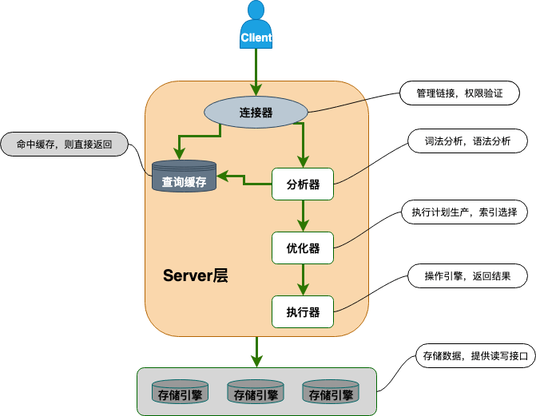
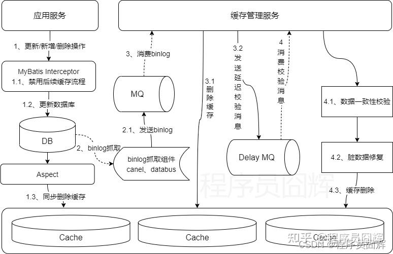
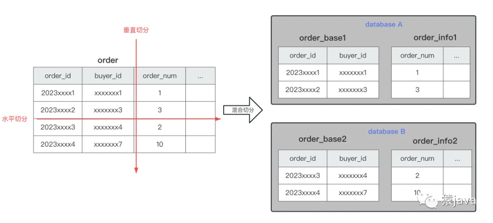

# 汇总

## Redis

1.  Redis为什么快。Redis是否单线程（单IO线程，新版本支持多线程）
Redis的速度非常快，主要有以下几个原因：

    -  **完全基于内存操作**：Redis是一个内存数据库，所有的数据都存储在内存中。相比于传统的磁盘数据库，内存的读写速度要快几个数量级。
    -  **高效的数据结构**：Redis为不同的数据类型（如字符串、哈希、列表、集合、有序集合）设计了专门且高效的数据结构，使得数据操作非常迅速。
    -  **单线程模型**：Redis的核心网络模型是单线程的。这避免了多线程环境下不必要的上下文切换和锁竞争带来的性能开销。因为CPU不是Redis的瓶颈，其瓶颈通常在内存和网络I/O。
    -  **I/O多路复用**：Redis使用I/O多路复用技术（如epoll）来处理大量的客户端连接。它将所有连接的I/O事件都放在一个队列中，用一个线程来处理，从而实现了高并发。

    准确来说：

    *   **核心网络处理是单线程的**：Redis处理客户端命令的请求和执行部分是单线程的。这就是我们通常说“Redis是单线程”的由来。
    *   **新版本引入了多线程**：从Redis 6.0开始，引入了多线程来处理网络I/O的读写和协议解析部分，以提高网络I/O的性能，但命令的执行依然是单线程的。这可以充分利用多核CPU的优势来处理网络请求，进一步提升整体性能。

    所以，简单地回答“单线程”或“多线程”都不完全准确。一个更好的回答是：**Redis的核心命令执行是单线程的，但在新版本中引入了多线程来优化网络I/O。**

2.  Redis的八种基本数据结构，原理和使用场景
    Redis直接暴露给用户的是5种基本数据类型（String, List, Hash, Set, ZSet）和一些扩展类型（如Bitmap, HyperLogLog, Geo, Stream）。这些类型的底层实现依赖于更基础的数据结构。我们这里主要讨论这些核心的底层数据结构。
    - 字符串（String）：底层实现是简单动态字符串（SDS），是一个动态的字符数组，支持修改和增长。存储了字符串长度，空间预分配，避免了频繁的内存分配和释放。
    - 哈希（Hash）：底层实现是哈希表（Hash Table），用于存储键值对。采用链式哈希解决哈希冲突，每个哈希桶存储一个链表，链表节点存储键值对。
    - 列表（List）：底层实现是双向链表（Doubly Linked List），支持在头部和尾部进行快速插入和删除操作。
    - 集合（Set）：底层实现是哈希表（Hash Table），用于存储唯一的元素。
    - 有序集合（ZSet）：底层实现是跳表（Skip List）和哈希表（Hash Table）的组合，用于存储有序的元素。跳表用于快速定位元素，哈希表用于存储元素的额外信息（如分数）。

    还有一些扩展类型：
    - Bitmap：用于存储二进制位的数组，支持位操作。
    - HyperLogLog：用于估计集合的基数（不重复元素的数量）。
    - Geo：用于存储地理位置信息，支持距离计算和范围查询。
    - Stream：用于存储和处理有序的事件流。

3.  Redis持久化，AOF的刷盘时机，RDB的bgsave具体流程
    Redis的持久化有两种方式：AOF和RDB。
    - AOF：Append Only File，追加只写文件。Redis将所有写命令追加到一个文件中，当需要恢复数据时，按照顺序执行这些命令。AOF提供三种刷盘时机：
        - 每次写命令后刷盘：每次写命令后立即将命令追加到AOF文件中，确保数据的实时持久化，但是性能会受到影响。
        - 每秒刷盘一次：每秒将写命令追加到AOF文件中，平衡了性能和数据安全性。
        - 由操作系统决定：由操作系统决定何时将写命令追加到AOF文件中，性能最佳，但数据安全性较低。
        - 优势：持久化数据更加完整，因为AOF记录了所有的写命令，所以可以在发生故障时丢失的数据更少。
        - 劣势：AOF文件会不断增长，恢复数据的速度会变慢。
    - RDB：Redis Database，Redis数据库文件。RDB是将Redis内存中的数据快照保存到磁盘上的一个二进制文件。可以手动触发bgsave，也可以配置自动触发。
        - 优势：RDB文件是一个二进制文件，恢复数据的速度快。
        - 劣势：RDB文件记录的是某个时间点的快照，所以在发生故障时可能会丢失部分数据。
        - bgsave是Redis的一个命令，用于异步地将内存中的数据快照保存到磁盘上的RDB文件中。同样还有一个命令是save，它是同步的，会阻塞Redis的其他操作。
        - bgsave的具体流程：
            1. **创建子进程**：Redis fork一个子进程，子进程负责持久化操作，父进程继续处理客户端请求，保证服务的高可用性。
            2. **生成快照**：子进程将内存中的数据快照保存到一个临时的RDB文件中。
            3. **替换旧文件**：当子进程完成保存后，用临时文件替换原来的RDB文件。
            4. **通知父进程**：父进程收到子进程的通知，更新相关的统计信息，如RDB文件的大小、上次保存的时间等。
    生产环境一般采用结合AOF和RDB的方式，AOF记录所有的写命令，RDB记录某个时间点的快照，两者结合起来可以最大程度地保证数据的安全性和恢复速度。

4.  Redis内存淘汰策略，LRU，LFU具体怎么实现的
    - LRU（Least Recently Used）：最近最少使用算法，根据数据的最近访问时间来判断哪些数据是最近使用的，将最近最少使用的数据淘汰。Redis使用的是近似LRU算法，每次随机采样一部分数据进行LRU淘汰。基于内存和性能的考量，只使用了hash表缓存数据并没有专门针对LRU算法的双向链表。底层数据结构使用了lru字段来维护数据最近一次访问的LRU时钟，每次key被访问时会更新该字段值。这种做法有一定缺陷，仅关注最近一次访问时间，没有考虑到数据的访问频率。
    - LFU（Least Frequently Used）：最近最少使用频率算法，根据数据的访问频率来判断哪些数据是最近使用的，将最近最少使用频率的数据淘汰。具体实现也是随机采样一部分数据进行LFU淘汰。采用hash表+双向链表的结构，数据在双向链表内按照热度值排序。热度值复用lru字段，将访问频率作为lru字段的低8位。
    - 随机淘汰：随机选择一个数据进行淘汰。
    - 不淘汰：不进行任何淘汰，当内存满时直接返回错误。
    - 内存淘汰策略的配置：当内存达到了maxmemory的阈值时，Redis会根据maxmemory-policy配置项来进行内存淘汰。默认是volatile-lru，即当内存满时，根据LRU算法淘汰最近最少使用的数据。

5.  Redis过期策略，定期删除和惰性删除的细节
    Redis的过期策略用于管理键的生命周期，确保过期的键能够被及时删除，释放内存空间。Redis的过期策略有两种：定期删除和惰性删除。
    - 定期删除：Redis会定时扫描过期的key，并删除它们。使用后台线程+随机采样的方式定期执行过期key的检查和删除。优点是及时删除过期的key，释放内存空间。缺点是会占用CPU资源，需要合理配置扫描频率和数量。
    - 惰性删除：当访问一个key时，会判断它是否过期，如果过期了就会删除它。如果过期的key很多，会占用很多内存。优点是不会主动占用CPU检查，缺点是过期的key如果一直不被访问，可能会一直占用内存。
    -  定时删除：在设置键过期时间的同时，也会为该键创建一个定时器，当定时器到期时，会立即删除该键。优点是及时删除过期的key，释放内存空间。缺点是会占用CPU资源可能会影响Redis的性能，需要合理配置扫描频率和数量。


    - 过期key的删除策略的选择：
        - 如果对数据的访问频率比较高，建议使用惰性删除策略，因为定期删除策略会阻塞Redis的其他操作。
        - 如果对数据的访问频率比较低，建议使用定期删除策略，因为惰性删除策略会占用很多内存。

6.  Redis主从集群和哨兵模式的原理
    目前实现Redis高可用的模式有三种：主从同步、哨兵模式和分片集群模式。
    - 主从同步：Redis主从同步是指多个Redis节点之间通过复制（replication）机制实现数据同步和备份。提高系统的可用性和读写性能，是分担Redis读写压力、保证高可用的重要手段。其中，一个节点作为主节点（master），负责接收客户端的写请求和执行写操作；其他节点作为从节点（slave），负责复制主节点的数据和执行读操作。主从集群的原理是通过将主节点的写操作记录到AOF日志中，然后从节点通过读取AOF日志并执行其中的写操作来实现数据同步。
    - 哨兵模式：Redis哨兵模式是指多个Redis节点之间通过哨兵（sentinel）机制实现自动故障转移和监控。其中，多个哨兵节点负责监控主节点的状态和从节点的状态，并在主节点故障时自动将一个从节点升级为新的主节点，确保系统的高可用性。哨兵模式的原理是通过多个哨兵节点之间的通信和投票机制来实现自动故障转移。

7.  分片集群模式的原理，Gossip协议
    - 分片集群模式：Redis分片集群模式是指将Redis数据分布到多个节点上，每个节点负责存储一部分数据。通过分片集群模式，可以实现数据的水平扩展和负载均衡。
    - Gossip协议：Gossip协议是一种用于节点之间通信的协议，用于节点之间的发现、同步和协调。在分片集群模式中，Gossip协议用于节点之间的发现和同步分片信息。
    - 分片集群模式的原理：
        1. **数据分片**：将Redis数据分片到多个节点上，每个节点负责存储一部分数据。
        2. **路由计算**：根据key的哈希值计算出key应该存储在哪个节点上。
        3. **数据同步**：当一个节点的数据发生变化时，通过Gossip协议将数据同步到其他节点上。
        4. **数据读取**：当读取一个key时，根据key的哈希值计算出key应该存储在哪个节点上，然后从该节点上读取数据。
        5. **数据写入**：当写入一个key时，根据key的哈希值计算出key应该存储在哪个节点上，然后将数据写入该节点。
8.  缓存穿透，缓存雪崩，缓存击穿及对应的应对策略
    - 缓存穿透：缓存穿透是指查询一个不存在的数据，由于缓存没有命中，导致每次查询都要去数据库查询，从而导致数据库压力增大。应对策略包括：布隆过滤器：在缓存层之前加布隆过滤器，快速判断数据是否存在；缓存空值：对查询结果为空的数据也在缓存中存储一个空值，设置较短过期时间；参数校验：对请求参数进行合法性校验，过滤明显非法的请求
    - 缓存雪崩：缓存雪崩是指在缓存中存储的大量数据在同一时间过期，导致所有请求都去查询数据库，从而导致数据库压力增大。可能会出现在：缓存服务器宕机；大量缓存设置相同的过期时间；缓存预热不足的场景。应对策略：过期时间随机化；多级缓存；服务降级。
    - 缓存击穿：缓存击穿是指查询一个非常热点的数据，由于缓存没有命中，导致每次查询都要去数据库查询，从而导致数据库压力增大。应对策略是设置热点数据永不过期；双缓存做备份，当热点数据缓存过期时，从备份缓存中读取数据。


9.  Redis的大Key，热Key如何应对
    - 大Key：大Key是指一个Key对应的值占用的内存空间很大，例如一个Hash类型的Key对应的值占用了100MB的内存空间。
        + 可以通过redis-cli --bigkeys命令扫描大Key
        + 可能会造成阻塞Redis主线程，性能下降
        + 解决方法
            - 数据结构优化，避免存储数据信息冗余
            - 压缩数据，例如使用压缩算法（如Snappy、Zlib）压缩数据，减少内存占用
    - 热Key：热Key是指一个Key被访问的频率很高，例如一个Hash类型的Key被访问的频率很高。热Key会导致Redis的性能下降，影响Redis的响应时间。应对策略是将热Key缓存到内存中，避免每次访问都去查询数据库。
        + 可以通过redis-cli --hotkeys命令扫描热Key
        + 可能会导致Redis单节点CPU使用率过高，响应变慢
        + 解决方法
            - 本地缓存
            - 热key复制；热key预加载
            - 读写分离

10. Redis是如何实现事务的
    - Redis事务的实现是通过MULTI、EXEC、DISCARD和WATCH命令来实现的。
    - MULTI命令：用于开启一个事务，为该客户端设置事务状态标志，后续的命令不会立即执行，而是被加入到事务队列中。
    - EXEC命令：按顺序执行事务队列中的所有命令。如果命令执行出错，该命令会失败，但事务不会回滚。其他命令会继续执行。
    - DISCARD命令：用于取消事务，清空事务队列。
    - WATCH命令：用于监控一个或多个键，如果在事务执行前有其他客户端修改了这些键，事务将被取消。

    - Redis事务不支持回滚：错误不会导致整个事务回滚。
    - 性能高但功能简单：适合简单场景

11. Redis实现分布式锁
    - 分布式锁：分布式锁是指在分布式系统中，多个进程或线程在不同的节点上同时访问共享资源时，需要协调它们的访问顺序，避免冲突。
    - 实现分布式锁的方式有很多种，其中比较常用的是基于Redis的分布式锁。基于Redis的分布式锁的实现原理是利用Redis的setnx命令（set if not exists），当多个进程或线程同时执行setnx命令时，只有一个进程或线程能够成功执行，其他进程或线程会失败。成功执行的进程或线程可以认为是获得了分布式锁，其他进程或线程可以等待或重试。
    - 基于Redis的分布式锁的实现方式有很多种，例如通过lua脚本实现分布式锁，通过redlock算法实现分布式锁等。
    - 基于lua脚本实现分布式锁的原理是利用Redis的eval命令执行Lua脚本，在脚本中判断锁是否存在，如果不存在则设置锁并返回成功，否则返回失败。
        - 脚本如下：
        ```
        local lockKey = KEYS[1]
        local clientId = ARGV[1]
        local expireTime = ARGV[2]
        local result = redis.call("SET", lockKey, clientId, "NX", "EX", expireTime)
        if result then
            return 1
        else
            return 0
        end
        ```
        - 获取锁的时候，会执行一段lua脚本，调用redis的setnx命令，当锁不存在时加锁，设置锁的key和value，过期时间为锁的超时时间。如果加锁失败，说明锁已经被其他进程或线程获得，返回失败。
        - 释放锁的时候，会执行一段lua脚本，调用redis的del命令，通过比较锁的value是否与客户端的value相等，相等则删除锁，否则不删除。
        - lua脚本执行是原子性的，不会被其他进程或线程中断，确保了锁的获取、释放是安全的。

    - 基于redlock算法实现分布式锁的原理是利用多个Redis节点同时设置锁，只有当大多数节点都设置成功时，才认为获得了分布式锁。
    - redlock算法的实现步骤：
        1. 客户端向多个Redis节点发送SET命令，设置锁的key和value，过期时间为锁的超时时间。
        2. 客户端收到大多数节点的回复后，判断是否获得了锁。如果获得了锁，客户端返回成功；如果没有获得锁，客户端向所有节点发送DEL命令，删除所有设置的锁。
        3. 客户端根据返回结果判断是否获得了锁。如果获得了锁，客户端执行业务逻辑；如果没有获得锁，客户端等待一段时间后重试。
        4. 客户端在业务逻辑执行完成后，向所有节点发送DEL命令，删除锁。

### 刁钻问题

1.  如果Redis主从架构下，使用惰性删除时，从节点的key已经到期了，读从节点时会怎么样
    - 当从节点读取一个过期的key时，从节点会检查key是否过期，如果过期了就会像主节点一样执行惰性删除：删除该key并返回一个空值（null）给客户端。
    - 但从节点不会向主节点或其他从节点同步删除该key的命令，因为从节点的key过期时间是从主节点同步过来的，主节点不会主动通知从节点删除key。
    - 从节点的key过期时间是从主节点同步过来的，主节点会在key过期时向所有从节点发送一个DEL命令，从节点会在收到DEL命令后执行惰性删除。
    - 如果主从复制延迟很大，从节点在读取时读取到过期的key.
    **总结**：在Redis主从架构中使用惰性删除时，读取从节点不会返回已过期键（3.2+版本），从节点会本地检查并删除，但真正的同步删除由主节点负责。这设计确保了数据一致性和读取安全性。

2.  Redis的Hash数据结构在扩容时是如何渐进式扩容的，如果某个Key一直不被访问，可以顺利扩容吗
    - 首先Redis的Hash使用了hash表作为基本的存储结构，每个字典/Hash结构由两个哈希表组成，每个哈希表中存储了其节点数组、大小等。其中新表是在扩容时新建的。
    - 当哈希表的负载因子超过阈值时，会触发渐进式扩容，进行rehash操作。
    - 每次对字典的操作（增删改查）都会触发迁移ht[0]中的一个桶到ht[1]中。
    - 迁移完成后，会将ht[1]设置为ht[0]，并且释放旧表。
    - Redis也会通过定时任务确保即使没有对字典进行操作，也会渐进式地迁移桶到新表中。
    - 如果某个Key一直不被访问，也是可以顺利扩容的，Redis中的渐进式rehash操作只要字典中其他元素有任何操作，都会被触发，另外，每次搬迁都是桶级别的，跟单个元素无关。而且还会有定时任务来兜底。

3.  Redis分片集群扩容的过程是怎么样，客户端请求如何重定向的，Redis的slot模式和一致性哈希有哪些区别

4. Redission有了解过吗？redissoin的时间轮？
---

## MySQL

1.  Mysql为什么用B+树，B+树和B树，红黑树等有什么区别

    Mysql选择B+树作为索引结构的主要要是因为B+树在数据库场景下具有显著的性能优势：
    - **更适合磁盘存储**：B+树内部节点仅存储键值（键值指的是主键及主键及所在列的值），叶子节点存储实际数据，且叶子节点是连续的，使得范围查询非常高效。而B数每个节点都可能存储数据，数据分布较为分散。
    - **查询性能较为稳定**：所有查询都需要达到叶子节点，路径长度一致
    - **更适合数据库场景特性**：通常数据库需要处理大量数据；经常进行范围查询；对磁盘I/O敏感

    B+树节点示例结构
    ```
    class BPlusTreeNode{
        int[] keys;
        BPlusTreeNode[] children; // 孩子节点
        BPlusTreeNode next; // 兄弟节点（指向下一个叶子节点）（B树则缺少此属性）
        Object[] values; // 叶节点实际数据存储 （B树会在内部节点也存储实际数据）
        int keyCount;
        boolean isLeaf; // 是否叶子节点
    }
    ```

    B+树相对于B树的区别：
    - **数据存储位置不同**：B+树所有数据都存储在叶子节点上，而B树每个节点都可能存储数据
    - **叶子节点是否连续**：B+树的叶子节点时连续的，是一个有序链表结构；而B树叶子节点不一定连续
    - **性能**：B+树范围查询比较高效，且插入删除因为都在叶子节点，所以较简单 

    B+树与红黑树的区别：
    - 结构上B+树是多路平衡树，红黑树是二叉平衡树。而且红黑树也是在每个节点都可能存储数据，相对也是不怎么高效。
    - B树和红黑树都更适合在内存中使用，因为其高效简单的插入删除操作。（Redis早期版本使用了红黑树作为ZSet的底层数据结构，但基于更简单且性能接近的原因，在Redis5.0+的ZSet都不再直接依赖红黑树）

2.  Varchar和Char
    Char和Varchar都是mysql中常见的字符串数据类型。
    
    - Char是固定字符串，使用时必须指定长度，例如Char(10)，表示该字段最多存储10个字符，如果实际存储长度小于声明长度，mysql会在末尾填充空格。而Varchar是可变长度，虽然也必须指定长度，但是实际存储的字符串长度可以小于声明长度，mysql会根据实际存储长度动态分配空间。

    - 性能上由于Char是固定长度，因此读取速度更快，因为mysql可以直接知道存储的起始位置；相对地Varchar则由于是可变长度，mysql需要根据长度信息来定位起始位置，读取速度相对慢一些。

    - 因此Char更适合存储固定长度的字段，例如固定长度标识符、手机号等；而Varchar更适合存储不固定的长度，例如输入文本、描述信息等。


3.  InnoDB和Myisam的区别
    InnoDB和MyISAM是MySQL数据库中两种常用的存储引擎。有以下区别：
    - **事务支持**：InnoDB支持事务处理（ACID即原子性、一致性、隔离性、持久性），提供行级锁定，适合一些需要事务的支持的场景，且支持回滚、提交和崩溃恢复能力，保证数据的完整性和一致性。而MyISAM则不支持事务，需要应用程序逻辑来支持数据完整性
    - **锁机制**：InnoDB使用行级锁定，多个用户可以同时对不同行进行操作，减少锁竞争，且支持多版本并发控制（MVCC），提高了并发性能；MyISAM使用表级锁定，整个表在读写期间被锁定，适合读多写少的场景，锁竞争可能会带来性能瓶颈。
    - **数据完整性**：InnoDB支持外键约束，可以维护表之间的关系，支持自动恢复和崩溃后恢复，保证了系统故障时的一致性。而MyISAM则不支持外键，也没有自动恢复机制，数据在系统故障后会出现不一致。
    - **性能**：InnoDB适合写密集和事务处理的场景，而且走了内存管理优化，提供缓冲池，提高了数据读取性能；而MyISAM适合读密集的应用场景，表级锁定在读取时性能比较高。
    - **存储结构**：InnoDB使用聚集索引，主键索引和数据存储在一块，提高主键查询性能，支持全文索引，性能相对较高；而MyISAM使用非聚集索引，数据和索引分开存储，也支持全文索引，但是性能不如InnoDB。
    - **适用场景**：InnoDB适用于需要事务支持、高并发写操作和依赖数据完整性的应用场景，例如电商、金融等；而MyISAM适用于读密集型场景，例如博客、新闻类。


4.  Mysql索引的数据结构和原理，索引优化，索引失效的条件，索引下推

    MySQL使用B+树作为其索引结构，是B树的一种变种，具有以下特点：
    - 多路查找树：B+树每个节点下有多个子节点，适合磁盘I/O操作
    - 顺序存储：所有叶子节点按顺序连接，便于范围查询
    - 高度平衡：无论插入还是删除，B+树始终保持稳定，确保查询效率稳定
    - 数据存储位置：实际的数据仅存储在叶子节点，而非内部节点
    
    MySQL不选择其他数据结构的原因分别如下：
    - 哈希：链式哈希解决哈希冲突的话，无法实现高效的范围查询
    - 二叉查找树：即右大于根，左小于跟的二叉树，会出现极限情况下退化成链表的情况
    - 红黑树：在二叉查找树的基础上增加节点自旋和调整，使得二叉查找树保持平衡，在顺序插入时还是会出现右倾的情况
    - AVL树：绝对平衡二叉树，虽然不存在右倾的问题，但是一个节点只能存储一个数据，磁盘I/O次数会比较多
    - B树：B树是相对较高效的结构，已经能尽可能地减少磁盘I/O了
    - B+树：仅在叶子节点存储数据，其他内部节点存储索引，单节点也能存很多索引数据，使得树的高度降低，并且叶子节点通过链表结构有序连接，便于范围查询。

    InnoDB索引原理:

    InnoDB是聚集索引方式，即数据行和索引键同页存储，首先建表时InnoDB会根据主键建立主键索引B+树

    主键索引树中内部节点存的都是key，例如主键字段Id和对应的值，在叶子节点存储的是主键ID对应的数据，比如在select * from user_info where id = 15，InnoDB就会根据id主键来查找主键索引树。

    如果为表里其他字段增加了索引，那InnoDB会根据该字段例如user_name来创建辅助索引树，辅助索引树中内部节点存的是该字段user_name和对应的值，在其叶子节点中存的是主键KEY，查找时，先查辅助索引树，找到主键KEY后，再根据主键KEY查找主键索引树拿到对应的数据。

    也就是说只有主键索引树存了具体的数据，其他索引树都不存储具体数据，而是存主键key，主要是为了节省存储空间，一个表中可能会有多个索引，如果每个索引树都存了具体数据，表的索引数据文件就会变得非常大，从节约磁盘空间角度来说，确实没有必要每个索引树都存储具体数据。（该过程也被称为回表）

    聚集索引和非聚集索引：
    - InnoDB中聚集索引是主键索引，辅助索引都是非聚集索引。
    - 聚集索引是数据行和索引键同页存储，而非聚集索引叶子节点存的是主键值和指针
    - 从查询效率上讲，聚集索引单词I/O即可直达数据行，而非聚集索引则需要回表查询
    - 聚集索引唯一，非聚集索引可重复

    索引设计的黄金法则：

    1. 最左匹配原则：最左匹配原则是指在使用联合索引时，MySQL会根据索引中的字段，从左到右依次匹配查询条件中的字段，最左匹配原则会一直往右匹配，直到遇到范围查询（例如>,<）为止，但是遇到>=,<=或者BETWEEN及前缀匹配LIKE时，是不会停止匹配的。最左匹配原则如果遇到跳过前列直接使用后列的会失效，例如联合索引（col1，col2，col3）,where条件是：where col2 = ？，这种会失效，但是如果交换了顺序，例如where col2 = ？ and col1 = ？，遇到这种情况，MySQL的查询优化器分析SQL语句时，会对查询条件做重排序，以便用到索引。


    索引优化的常用方法：

    1. 合理选择索引列，例如索引建在值选择性高的列；针对查询频率较高的列优先创建索引。
    2. 使用联合索引，建联合索引时以最左匹配原则来合理排序
    3. 查询时避免索引失效，例如查询条件避免函数使用，避免子查询，避免非前缀匹配，避免在索引列出现NULL值，避免出现隐式类型转换（当操作符左右两边的数据类型不一致时，会发生隐式转换）等
    4. 使用覆盖索引，尽量将查询字段完全包含在索引中，避免回表操作 
    5. 定期维护、重建索引，避免碎片化


    索引下推：
    索引下推，简称ICP，指的是MySQL提供的一项索引优化功能，**通过将部分查询条件推送到存储引擎层，减少回表操作次数**，提高查询性能。ICP适用于非聚簇索引和复杂查询条件，可以显著减少存储引擎层和server层之间的数据传输量。

    

    ICP 工作原理：

    ICP通过将部分查询条件推送到存储引擎层，让存储引擎层在遍历索引时直接过滤掉不符合条件的记录，从而减少回表次数。详细步骤如下：
    1. 查询优化器分析，哪些条件可以推送到存储引擎层
    2. 推送：查询优化器可以利用索引的条件推送到存储引擎层；存储引擎层在遍历索引时，会根据推送的条件先过滤掉不符合的记录。
    3. 回表：过滤后的记录再进行回表操作，获取完整数据行。这时记录已被过滤，回表次数将大大减少。

    ICP适用场景：

    - 非聚簇索引
    - 复杂查询条件中用到索引的部分查询子句

5.  数据库Join的原理（Nested Join, Nested index Join, Hash Join等）
    join语法：SELECT * FROM A JOIN B ON A.id = B.id
    MySQL中会根据表的大小、索引情况和查询条件，查询优化器会选择不同的JOIN算法来执行表连接操作。

    - **Nested Loop Join算法（嵌套循环连接）**： 最基本的连接算法，通过两层for循环来完成join，先遍历第一个表，对外层循环中的每一行，遍历第二个表，检查是否存在满足连接条件的行。多适用于小表的连接或者是join条件的列没有索引时，默认会选择Nested Join。时间复杂度O(m * n)
    - **Nested Index Loop Join算法（索引嵌套循环连接）**：索引嵌套循环连接是Nested Join的优化版本，利用索引来加速内存循环的查找，在遍历第二个表时，利用索引来快速查找满足连接条件的行。这种适用于join条件的列有索引的情况，时间复杂度O(m * log n)
    - **Hash Join算法（哈希连接）**：哈希连接是一种高效的连接算法，适用于大表间的连接，缺点可能会存在哈希冲突过多导致的性能问题，它通过哈希表来加速查找，首先选择较小的表，逐行遍历该表，将join条件列作为key，行的指针作为value，构建哈希表；然后遍历较大的表，对于每一行，计算连接列的哈希值，查找哈希表，找到匹配的行。时间复杂度O(m + n)
    - **Sort-Merge Join算法（排序-合并连接）**：这是一种适用于有序数据的连接算法，通过先排序再合并的方式来实现，先将两个表的join条件列排序，再用双指针分别遍历两个表，逐行比较join条件列的值，最终找到匹配的行，时间复杂度O(mlogm * nlogn)
    - **Block Nested Loop Join算法（块嵌套循环连接）**：分块处理，将大表分成多个块，每个块可以放入内存，然后双层for循环，先遍历小表，然后对小表每一行，遍历当前块中的行，匹配到满足join条件列的数据，适用于当数据表特别大，没法完全放入内存时的操作，时间复杂度O(m * n)

6.  redo log的作用，buffer pool的原理，redo log刷盘的时机，redo log满了怎么办处理，为什么用redo log而不是bin log恢复数据
    
    redo log是InnoDB存储引擎的日志文件，用于记录事务操作的变化，确保在数据库崩溃后需要恢复数据时，能够通过读取redo log二进制文件完成数据恢复，确保数据的一致性。

    buffer pool是InnoDB的内存区域，用于缓存数据页和索引页，减少磁盘I/O操作。通过将频繁访问的数据页保留在内存中，减少对磁盘的操作，能显著提高查询和更新的性能。

    buffer poll工作原理是先将数据页加载到内存中，在查询或修改时，先检查buffer poll中是否存在所需的数据页，不存在的话则从磁盘读取加载到buffer pool，然后对这些内存中的数据页利用LRU算法来管理，对修改后的数据页（脏页）通过后台线程定期写入到磁盘，确保数据一致性。

    redo log刷盘常见的时机场景如下：
    - 事务提交时，通过配置innodb_flush_log_at_trx-commit=1来控制这一行为，当事务提交时InnoDB会确保redo log已经写入到磁盘。
    - 后台线程定期同步，InnoDB的后台线程会定期同步redo log刷盘，通常是每秒执行一次。
    - buffer pool脏页刷新，当buffer poop脏页刷新到磁盘时，相关的redo log也会被同步到磁盘
    - checkpoint操作，在执行checkpoint操作时，InnoDB会将redo log内容同步到磁盘中。
    - 系统崩溃时，InnoDB也会尝试做redo log刷盘。
    
    redo log的日志文件形式是一个循环日志文件组，类似于唤醒数组，从头开始写，写到末尾后又从头开始。当日志文件组写满之后，MySQL会利用checkpoint机制将脏页写回磁盘，并更新redo log checkpoint位置。

    为什么使用redolog恢复数据而不是binlog？

    这是因为redolog记录的是物理数据页的修改，恢复数据时可以直接应用redolog，不需要解析sql，恢复效率高；而binlog都是逻辑日志，可以理解为记录的都是sql语句，如果用binlog还需要解析执行sql语句，效率低。
7.  redo log, undo log, bin log的原理和作用

    redo log(重做日志)、undo log(回滚日志)、bin log(归档日志)是MySQL中的比较重要的几个二进制日志

    **redo log（重做日志）**
    - redo log是InnoDB存储引擎的日志文件，又称作重做日志文件，用于记录事务操作的变化，记录的是数据页修改之后的值，用于在数据库崩溃后恢复数据，确保数据的一致性。
    - 写入时机：理想情况下，每次事务对数据页进行修改时，都会生成redo log，
    - 持久化：redo log是持久化的，及时数据库崩溃，这些日志也会保留在磁盘上
    - 先明确MySQL中是以页为单位，查询记录时，会从硬盘把一页的数据加载出来，放到Buffer Pool（数据页缓冲池）中，后续的查询更新都是先从Buffer Pool中找，如果没命中再去硬盘加载，减少磁盘I/O开销。更新的时候，会把在“什么数据页上做了什么修改”记录到redo log buffer中，接着刷盘到redo log文件里。
    - Redo log的写入流程： 
        - 事务执行，修改Buffer Pool。InnoDB会先在Buffer Pool中找到id为1的数据对应的数据页，然后修改此数据行，此时该页变成“脏页”，然后生成一条redo log记录，写入到redo log buffer中。
        - 事务提交，触发刷盘。事务提交时，InnoDB会根据innodb_flush_log_at_trx_commit参数配置的刷盘策略决定是否将redo log buffer刷入磁盘（这一步是保证持久性的关键）
        - 当脏页达到阈值或者事务提交时，InnoDB会将脏页数据写入到数据文件，但是刷盘前必须确保该页对应的redolog已落盘，否则数据崩溃回复数据时会丢失数据。
        - 刷盘策略：innodb_flush_log_at_trx_commit取值0（延迟写）,1（实时写，实时刷）,2（实时写，延迟刷），只有当1时，每次事务提交都会刷盘，这样才不会丢失任何数据，
        - 另外InnoDB引擎有一个后台线程，每隔1秒，就会把redo log buffer中的内容写入到文件系统缓存，然后调用fsync刷盘。也就是说 如果一个没有提交事务的redo log记录，也可能会刷盘，因为redo log是需要写入到redo log buffer中的，写入到redo log buffer时实际事务还没及提交，而InnoDB的后台线程每隔1秒扫描一次，因此会redo log buffer中的redolog记录会被后台线程扫描刷盘。
        - 刷盘时机还要面临其他情况。例如redo log buffer空间占用即将达到阈值，也会触发刷盘；关闭服务器时触发刷盘；定期执行checkpoint检查点操作触发刷盘等。
        - 当事务执行期间，MySQL挂了或者宕机了，这部分日志丢了，但是事务没有提交，所以日志丢了也不会有损失。
        - redo log记录的不是完整数据页，而是表空间号、数据页号、磁盘文件偏移量、更新值等，所以相对于数据页刷盘性能更好，如果每次都用完整数据页刷盘，在只更新某一行数据时，就得刷盘整个数据页，比较浪费、耗时。

    **Bin log（归档日志）**

    Bin log是逻辑日志记录，记录内容是语句的原始逻辑，可以直接看做是原来SQL语句，只不过将SQL语句翻译了下，属于是MySQL中的server层。不管底层是什么引擎，只要发生了数据更新，都会产生bin log日志。

    另外，相对于redo log的循环写+覆盖的方式，bin log是通过追加的方式来写入的，可以通过max_binlog_size来设置每个binlog日志文件大小，当大小超过给定值后，会生成新的文件来保存。

    Bin log主要使用场景有两个，主从复制和数据恢复。
    - 主从复制，从Master端开启bin log，然后将bin log发送到各个slave端，slave端重放bin log实现主从数据一致。
    - 数据恢复，通过使用```mysqlbinlog```工具来恢复数据。

    bin log的写入时机也非常简单，事务执行过程中，先把日志写到bin log cache中，事务提交时，再把binlog cache写入到binlog文件中。可以通过设置sync_binlog参数来控制，同样地当sync_binlog=1时，代表每次事务提交都执行fsync刷盘。

    redo log和bin log虽然都属于数据库事务持久性的保证，但是写入时机是不同的，redolog在事务执行过程中可以不断写入，而binlog只会在事务提交时写入，如果redolog日志写入后，binlog日志写入期间发生了异常，这时候就会出现两份日志记录的数据不一致的情况。

    为了解决这一问题，InnoDB引擎使用了**两阶段提交**方案。

    将redolog的写入拆成了两个步骤 prepare和commit，这就是两阶段提交。在prepare阶段，将redolog中的事务状态设置为prepare，然后将redolog持久化到磁盘中。在commit阶段，将binlog持久化到磁盘中，并且根据事务id将对应的redolog设置为commit状态。

    在异常情况下，不论是redolog已经写入但binlog未写入，还是binlog和redolog都写入，但都处于prepare状态，此时redolog都处于prepare状态。
    
    MySQL重启时，会按顺序扫描redolog，碰到处于prepare状态的redolog时，会拿着事务id去binlog中查看是否存在此事务id，如果没有，说明是redolog写入了，但binlog写入时异常了，如果有，就说明两者都写入刷盘了，但是两者都没有commit。
    
    对于处于prepare状态的redolog，既可以提交事务，也可以恢复事务，这取决于在binlog中是否能找到对应的事务id，如果有就提交事务，没有就回滚事务，这样就可以保证两份日志的一致性了。

    当然，两阶段提交方案也是有缺点的，一是磁盘I/O次数高，如果innodb_flush_log_at_trx_commit=1和sync_binlog=1的设置参数，每次事务提交都会有两次刷盘。另外一个确定就是锁竞争激烈，两阶段提交方案虽然能保证单事务两个日志的一致性，但是在多事务时无法保证两者提交顺序一致，因此需要加锁来保证多事务下的日志提交顺序一致性。
    
    因此又有了新的优化方案：**组提交** 当有多个事务提交时，会将多个binlog刷盘操作合并成一个，从而减少磁盘I/O次数，然后将原来两阶段中的commit阶段，分为三个过程：flush、sync、commit，每个阶段都有加锁保证事务写入顺序。


    **undo log（回滚日志）**

    每个事务对数据的修改都会被记录到undo log中，当执行事务过程中出现错误或者需要执行回滚操作时，MySQL可以利用undo log将数据恢复到事务执行之前的状态。

    undo log属于逻辑日志，例如执行一条delete语句后，undo log都会记录一条相对应的insert语句。同时undo log的信息也会被记录到redo log中，因为undo log也要实现持久性保护，知道没有事务需要它，undo log本身是会被删除清理的，例如insert操作，在事务提交之后就可以清除了；update/delete操作在事务提交后不会被立即清除，而是添加到history list中，由后台线程purge进行清理。

    undo log适用场景：
    - 事务回滚，在事务需要回滚时，undo log用于撤销事务对数据页的修改，确保数据一致性。
    - 多版本并发控制（MVCC）：undo log用于实现多版本并发控制，允许事务读取数据的旧版本记录，而不被其他事务的修改影响。

8.  4个隔离级别的原理，分别怎么实现的。MVCC的原理，next-key-lock如何解决幻读（有没有例外情况）

    MySQL有四个事务隔离级别，分别是：READ UNCOMMITTED(读未提交)，READ COMMITTED(读已提交)，REPEATABLE READ(可重复读，MySQL默认隔离级别)，SERIALIZABLE(可串行话)。每种隔离级别通过不同的机制来控制并发事务之间的可见性和冲突。

    - **READ UNCOMMITTED（读未提交）**

    原理：事务可以读取其他事务尚未提交的数据，即“脏读”，在READ UNCOMMITTED级别下，事务不会对读取的数据进行任何锁操作，也不会使用多版本并发控制（MVCC），这意味着一个事务可以看到其他事务尚未提交的修改。

    缺点：这种隔离级别数据一致性太弱，可能会导致脏读、幻读、不可重复读

    实现：事务对当前读取的数据都不加锁，都是当前读（读取数据最新提交版本）

    - **READ COMMITTED（读已提交）**
    原理：允许读取并发事务已经提交的数据，在READ COMMITTED级别下，读操作会使用行级锁，确保读取数据是已提交版本；使用MVCC多版本并发控制，为每个查询生成一个快照，确保读取数据是一致的。即通过行级锁+MVCC来避免脏读的问题

    缺点：可以避免脏读，但是幻读和不可重复读的问题仍有可能发生。

    实现：事务对当前读取的事务不加锁，都是快照读（即MVCC为每个事务开始时生成一份数据快照，读取从数据快照读）；而事务在更新某数据的瞬间，先对其加*行级排他锁*，直到事务结束释放


    - **REPEATABLE READ（可重复读）**
    原理：对同一字段的多次读取结果都是一致的。事务在读取数据时，会使用快照读（即使用MVCC为每个事务生成一个快照，确保整个事务期间数据读取时一致的），避免不可重复读的问题。很大程度上解决了幻读的问题。

    实现：对普通select语句用快照读，对更新数据的操作使用加*Next-key-lock(结合行级锁和间隙锁)*锁定扫描到的记录及记录之间的范围（间隙）防止其他事务在这个范围内插入或删除数据，从而避免幻读，直到事务结束释放，通过间隙锁在这个级别就已经很大程度上解决了幻读问题。

    - **SERIALIZABLE（可串行化）**
    
    最高的事务隔离级别，所有事务逐个依次执行，这样事务之间就完全不会产生干扰，该级别可以完全解决脏读、不可重复读、幻读的问题

    实现：读取数据时，先对其加行级共享锁，知道事务结束释放，都是当前读；更新数据时，先对其加表级排它锁，知道事务结束释放

    - **脏读、不可重复读、幻读**

    脏读：是指一个事务A读取到了另一个事务B未提交的数据，假如另一个事务B这时发生了回滚，那A事务读取到的就是不存在的数据，也就是发生了脏读

    不可重复读：是指同一个事务在多次读取同一行数据时，得到了不同的结果，这时因为在两次读取之间，有另一个事务对该行数据做了修改或删除操作。例如：事务A第一次读取了表中年龄的数据，这时事务B修改了改行数据，事务A再次读取，两次读取结果不一致。这就是不可重复读

    幻读：是指一个事务在执行多次相同条件查询时，发现*结果集中出现了新的“幻影”行*，也就是说记录的数量发生了变化，通常是因为另一个事务B在两次相同条件查询期间插入或删除了数据。

    **MVCC实现原理**

    MVCC的实现是通过保存数据在某个时间点的快照来实现的，每个事务读取到的数据都是一个历史快照，称为*快照读*，不同于*当前读*，*快照读*读到的数据可能不是最新的，但是快照隔离能使得整个事务看到的数据都是事务开始时的数据状态。而写操作不覆盖已有数据项，而是创建一个新的版本，知道所在事务提交才变为可见。

    InnoDB实际实现时，会在每行数据后添加额外的隐藏的事务版本号来实现MVCC，每开启一个新的事务，事务的版本号就会递增，虽然每行记录都需要额外的存储空间和维护工作，但是可以减少锁的使用，读数据性能很好。例如在select时，只会读取版本号<=当前事务版本号的记录，insert时保存当前事务版本号作为行创建版本号，delete时，保存当前事务版本号作为行删除版本号，

    **Next-key-lock（行锁+间隙GAP锁）**：
    行锁可以防止别的事务修改或删除数据；GAP锁防止别的事务新增，行锁和GAP锁结合形成的Next-key-lock共同解决了RR级别下的幻读问题

    InnoDB中的间隙锁是在索引B+树的基础上，利用索引记录的顺序关系，确定加锁的*间隙*范围，从而对这个范围内的*间隙*加锁。

    Next-key Lock的有效性高度依赖索引的正确使用，当索引使用不当或存在问题时，Next-key Lock可能无法正常工作，可能导致幻读问题，例如事务中的查询使用!=、使用函数等，会造成Next-key Lock无法精确控制锁定范围，进而可能导致锁范围扩大、并发性能下降或数据一致性问题


9.  行锁，表锁，意向锁
    
    行锁是对表中的单行或者多行数据加锁，锁定期间其他事务不能对被锁定的行记录进行读写操作。这种锁粒度小，并发度高，仅锁定部分行，不同事务之间可以同时对不同行进行操作，缺点是实现复杂，开销大，容易出现死锁。

    表锁是对整个表进行锁定，锁的粒度大，实现简单适合对表进行批量操作，缺点是并发性能差，容易导致锁冲突。

    意向锁是一种辅助锁，用于表示事务对表中的某一行或多行数据记录有锁定意图，本身并不直接锁定数据，而是优化锁的管理。分为意向共享锁和意向排它锁。意向锁的存在可以减少锁的冲突，提高并发性能。


10. 主从架构的各种问题（主从延迟的解决方法，缓存一致性问题）
    **CAP法则（Consistency一致性、Availability可用性、Partition Tolerance分区容错性）**
    
    CAP法则指的分布式系统设计的重要理论，在分布式系统中，最多能同时满足CAP三个特性中的两个

    主从架构下的**主从复制**过程：
    1. 写入binlog，主库更新本地存储数据，写入binlog日志文件，然后提交事务
    2. 同步binlog，从库得到binlog日志发生变化的通知后，从库拉取数据
    3. 回放binlog，从节点请求拿到binlog数据后，写入到relay-log中继日志后，返回复制成功的响应给主节点；从节点监听到relay-log变更，开始读取日志记录，回放binlog更新从节点数据，实现主从数据一致性。

    主从同步延迟通常是由主库与从库之间的网络延迟、从库处理能力、主库写操作量等因素造成，长时间的同步延迟可能会影响系统的数据一致性。
    
    一般可以通过执行show slave status，看关键字段：Second_behind_master标识落后主库的秒数，Slave_IO_running和Slave_SQL_running标识I/O线程和sql线程是否正常执行

    处理方法一般有：
    1. 优化主库性能，增加主库硬件资源（增加CPU内存硬盘）优化SQL语句避免拖累数据库性能
    2. 优化从库性能，从库性能直接影响到主从同步的速度，同样也可以优化从库的查询
    3. 对于从库，可以调整相关MySQL配置，例如调整innodb_buffer_pool_size增加InnoDB缓存大小，启用多线程复制
    4. 监控和自动化处理。使用监控工具持续跟踪复制延迟，及时发现问题，另外也可以采取一些自动化工具（MHA、Orchestrator）处理

    **缓存一致性问题一般是指数据库和缓存数据不一致的情况**，解法：

    一般可以采取先操作数据库再删除缓存，不推荐先删除缓存在操作数据库，这样一是导致并发情况下其他线程在缓存中发现没数据后，直接取读数据库，除了数据不一致外，还可能会造成缓存击穿导致数据库崩溃。

    先操作数据库再删除缓存是相对影响更小的方案，如果第二步（删除缓存）出现失败的情况，可以采用重试机制（例如删除失败发MQ消息不断重试删除缓存，知道删除成功或重试5次）来解决。

    - **延迟双删策略**，有两种实现方式，同样都是删两次缓存，主要是先删缓存，还是先删数据库的区别。
    
    延迟双删是一致性相对更高一些的方案。
    
    先删除缓存，再写数据库，延迟一段时间间隔（例如1s），再删除缓存。这样是为了将1秒内所造成的缓存脏数据再次删除

    - 删除缓存后到写数据库之前，读请求可能会访问到旧数据，虽然再次删除缓存会解决，但是这块时间间隔内读的都是帐数据
    - 极端情况特殊场景下，访问到脏数据的线程，在第二次删缓存之后，又更新了缓存，会造成后续请求读缓存和数据库不一致。
    - 但是也会存在间隔的时间不好把握的问题。

    先更新数据库，再删缓存，延迟一段时间后再删一次缓存。更容易保证数据一致性。

    - 最终的延迟删除缓存可以确保最终的数据一致性
    - 可能会造成数据库的压力，因为在删除缓存和重新加载缓存期间，所有读请求都会直接访问数据库


    延迟双删已经是数据一致性相对较高的方案了，如果还需要进一步保证（例如确保第二部删除缓存一定要成功），可以采用*异步监听binlog + 可靠消息+重试机制*，这种方案也有问题：脏数据时间窗口较大（从监听到发mq到消费mq耗时可能会较长，这段时间是可能的脏数据窗口，极端场景下可能出现canal组件宕机）

    1. 更新数据库后不做操作
    2. Canal等组件监听binlog发现有更新后就发可靠MQ删除缓存
    3. 如果删除缓存失败，就基于手动ack、retry等机制，让消息在优先次数之内不断重试。

    补充：Canal是阿里开源的中间件，模拟 MySQL 主从复制的交互协议，把自己伪装成一个 MySQL 的从节点，向 MySQL 主节点发送 dump 请求，MySQL 收到请求后，就会开始推送 Binlog 给 Canal，Canal 解析 Binlog 字节流之后，转换为便于读取的结构化数据，供下游程序订阅使用。

    https://zhuanlan.zhihu.com/p/651106152
    
    以下是从知乎上复制过来的，参考学习：

    参考知乎上分享的生产可用的解决方案：**缓存三重删除 + 数据一致性校验 + 更新流程禁用缓存 + 强制读Redis主节点**
    整体流程图：
    
    整体方案如下：
    - 更新数据库同步删除缓存
    - 监听数据库的binlog异步删除缓存：带重试，保障一定会最终删除成功（核心）
    - 缓存数据带过期时间，过期后自动删除，越近更新的数据过期时间越短
        - 主要用于进一步防止并发下的脏数据问题
        - 解决一些由于未知情况，导致需要更换缓存结构的问题
    - 监听数据库的binlog延迟N秒后进行数据一致性校验 （核心）
    - 解决一些极端场景下的脏数据问题
    - 存在数据库更新的链路禁用对应缓存
        - 防止并发下短期内的脏数据影响到更新流程
    - 强制读Redis主节点
    - 异步查询数据一致性校验，对比数据库查询得到的值和缓存值，将结果进行打点统计，看数据校验不一致率有多少，如果超过1%，可能流程有问题，需要进一步排查优化。如果低于0.01%，那基本就没啥问题了。 （监控设施）

    缓存和数据库一致性保障方案，目前网上的资料大多是类似于方案3，如果你能在面试中说出我给的这个方案，相信可以让面试官眼前一亮，这其实就是你的加分项，可以帮助你从众多候选人之中脱颖而出。

    1、想要提高应用的性能，可以引入「缓存」来解决

    2、引入缓存后，需要考虑缓存和数据库一致性问题，可选的方案有：「更新数据库 + 更新缓存」、「更新数据库 + 删除缓存」

    3、更新数据库 + 更新缓存方案，在「并发」场景下无法保证缓存和数据一致性，解决方案是加「分布锁」，但这种方案存在「缓存资源浪费」和「机器性能浪费」的情况

    4、采用「先删除缓存，再更新数据库」方案，在「并发」场景下依旧有不一致问题，解决方案是「延迟双删」，但这个延迟时间很难评估

    5、采用「先更新数据库，再删除缓存」方案，为了保证两步都成功执行，需配合「消息队列」或「订阅变更日志」的方案来做，本质是通过「重试」的方式保证数据最终一致

    6、采用「先更新数据库，再删除缓存」方案，「读写分离 + 主从库延迟」也会导致缓存和数据库不一致，缓解此问题的方案是「延迟双删」，凭借经验发送「延迟消息」到队列中，延迟删除缓存，同时也要控制主从库延迟，尽可能降低不一致发生的概率后记

    本以为这个老生常谈的话题，写起来很好写，没想到在写的过程中，还是挖到了很多之前没有深度思考过的细节。

    在这里我也分享 4 点心得给你：

    1、性能和一致性不能同时满足，为了性能考虑，通常会采用「最终一致性」的方案

    2、掌握缓存和数据库一致性问题，核心问题有 3 点：缓存利用率、并发、缓存 + 数据库一起成功问题

    3、失败场景下要保证一致性，常见手段就是「重试」，同步重试会影响吞吐量，所以通常会采用异步重试的方案

    4、订阅变更日志的思想，本质是把权威数据源（例如 MySQL）当做 leader 副本，让其它异质系统（例如 Redis / Elasticsearch）成为它的 follower 副本，通过同步变更日志的方式，保证 leader 和 follower 之间保持一致


11. 读写分离，分库分表
    
    **读写分离**是一种数据库优化架构模式，通过将数据库的读操作和写操作分配到不同的数据库实例上，以提高系统的性能、扩展性和可用性。

    读写分离的最大问题就是主从延迟带来的主从数据不一致的问题。

    读写分离方案通常有：
    - 硬编码，在应用程序中使用多个数据源，手动管理。
    - 使用第三方组件，继承在应用程序中，代理应用程序中数据库请求，自动分发路由到主库或从库。
    - 代理中间件：在应用程序和数据库之间部署一个代理中间件，所有数据库路由均通过这个中间件来代理。

    主从复制的类型有：*同步复制*、*异步复制*、*半同步复制*

    同步复制：主库提交事务后，等数据复制到从库后，再返回给客户端响应，性能和可用性较差。
    
    异步复制：默认，主库提交事务后，返回给客户端响应，复制操作为异步操作，但是这种如果复制过程中主库宕机了，会造成数据丢失

    半同步复制：折中方案，事务线程只要有一部分从库复制成功，就返回成功，而不是等待所有数据同步后再返回客户端响应。

    **分库分表**

    分库分表是为了将数据分散到多个节点，通过负载均衡和故障抓你，提高并发处理能力和可用性

    分库是指在表数量不变的情况下对库进行切分。例如，库A中存了user和order表，将两张表切分到两个数据库，user表放到database A，order表放到database B

    分表是指在库数量不便的情况下对表进行切分，例如将user表分成user1和user2表。

    主流切分方式由三种：水平切分、垂直切分和混合切分。

    水平分表：例如将order表按照order_id的数据范围水平切分为order1表和order2表

    水平分库是指将表水平切分后，分到不同的数据库中，使得每个库具有相同的表，表中数据不同；水平分库一般伴随着水平分表。

    垂直切分：

    垂直分表是指将存在一张表中的字段切分到多张表中。例如将order表按照字段垂直切分为order_base表和order_info表，两张表分表包含原来的order表中的一部分字段

    垂直分库是指将单个库中的表分到多个库中，每个库包含的表不一样。

    混合切分其实就是水平切分和垂直切分的组合。

    切分策略一般有三种：RANGE范围、hash切分、映射表。

    - Range范围：按照某个字段的数据区间来进行切分，优点是方便扩容，每次数据量达到range值就新加一张表，可以自动化扩容；缺点是存在写偏移，可能有热点问题，例如新注册的用户，活跃度较高，那很多读写流量就会都集中在新的user表中。

    - hash切分：通过对分表建key进行一定的运算（取余、取模、hash等），通过运算结果来决定路由的库和表，也是主流方案。有点事数据分片比较均匀，缺点是，如果hash算法选择不合理，扩容可能需要迁移数据，另外数据被切分到不同的库和表中，可能存在跨节点查询和分页等问题。

    - 映射表：其实是range范围和hash切分的混合模式，将分表键和数据库的映射关系记录在一个单独的表（形式也可以使配置中心或者配置文件等）。有点事可以灵活设置路由规则，缺点是方案比较复杂。

    分库分表带来的问题：
    
    - 定位和维护难度直线上升
    
    - 分布式ID，分库分表后，需要维护全局唯一的ID

    - 分布式事务，可以在业务实现设计上避免使用分布式事务

    - 跨库关联、分页、排序问题，选择合适的分表字段；或者在业务代码中分别查询组装，或者使用分布式框架，例如ElasicSearch

12. 深分页优化方案
13. 冷热分离方案
14. 间隙锁死锁的解决方法
15. 执行一条SQL的过程

    MySQL 主要分为 Server 层和引擎层，Server 层主要包括连接器、查询缓存、分析器、优化器、执行器，同时还有一个日志模块（binlog），这个日志模块所有执行引擎都可以共用，redolog 只有 InnoDB 有。引擎层是插件式的，目前主要包括，MyISAM,InnoDB,Memory 等。

    查询语句的执行流程如下：权限校验（如果命中缓存）--->查询缓存--->分析器--->优化器--->权限校验--->执行器--->引擎
    
    更新语句执行流程如下：分析器---->权限 校验---->执行器--->引擎---redo log(prepare 状态)--->binlog--->redo log(commit 状态)
16. 慢SQL怎么优化

    - 首先对慢SQL语句进行诊断分析，适用explain来查看SQL的执行计划 EXPLAIN select * from sys_log。重点关注其中的type列的连接类型、key列的实际适用索引情况、rows列的扫描行数、extra列的额外信息
    - 重点排查索引使用情况，是否有索引不生效、未加索引、索引不合理等情况，优化索引
    - SQL语句优化，例如优化where条件，将选择性高的条件放前面，避免使用!=、IS、NULL等操作符，避免使用IN，优化JOIN操作，确保JOIN列上有索引，减少JOIN表数量，优化LIMIT和分页等。
    - 其他优化手段例如：避免SELECT * , 使用子查询来代替JOIN，将复杂查询分解为多个简单子查询；定期归档历史数据；


---

## JAVA

1.  Equals,hashcode方法，equals方法满足哪些特性，hashcode用在了哪些地方，Hashmap中的hashcode怎么用的
2.  线程池的参数，有哪些线程池类型，线程池的各种抛弃策略适合哪些场景，线程池的原理
3.  Thredlocal的原理，为什么容易内存泄漏
4.  Syschronized和Lock的区别，AQS的原理，volatile
5.  JVM的原理，垃圾回收，分代收集的算法，各种问题怎么排查（频繁Full GC，内存占用大，OOM等），JVM各种参数的优化。
6.  CMS, Parralel, G1等垃圾回收器的原理
7.  JAVA类加载的过程与这样做的原因，有没有办法打破双亲委派，Class这个类在哪一块区域
8.  Spring中Bean的生命周期，Spring MVC的流程，Spring IOC和AOP的原理，为什么动态代理必须基于接口？
9.  各种Collection的原理，Hashmap，Hashtable，ArrayList，LinkedList，Hashset，Treemap，ConcurrentHashMap（重点，扩容机制，写入机制，新旧版本对比（阻塞队列等））
10. String, StringBuffer, StringBuilder的区别，String不可变有什么好处？
11. NIO, BIO, AIO
12. 虚拟线程

### 刁钻问题

1.  设计一个JVM监控程序，你应该关注哪些指标，怎样设计？


2.  equals方法满足哪些特性，有没有可能 a.equals(b)是true，但是b.equals(a)是false
3.  ConcurrentHashmap的扩容机制，如果某些块或者者桶一直不被访问，能扩容成功吗

---

## 操作系统/网络 高频问题

1.  虚拟地址，内存管理等方式
2.  Linux常用命令
3.  进程，线程，协程的各种概念
4.  各种IO, select, poll, epoll, 零拷贝之类的
5.  死锁，死锁检测，死锁恢复，死锁防止
6.  什么是操作系统，用户态内核态，系统调用的概念
7.  进程，线程之间通信的方式
8.  内存管理，分页分段等
9.  TCP, UDP
10. 输入一个URL到渲染完成经过了哪些过程
11. HTTP1.0, 1.1, 2.0, 3.0分别有哪些特性
12. HTTPS的基本概念和流程
13. Cookie, Session和JWT的各种概念

## Kafka

1.  Kafka如何保证的高吞吐（顺序写磁盘，零拷贝，批量写）
2.  Kafka的架构（producer, broker, consumer group, partition的主从机制等）
3.  Kafka如何保证消息的顺序
4.  如何保证消息不丢失（ACK机制），如何保证消息不被漏消费或者多消费（幂等性的角度）
5.  如何合理设置partition的数量
6.  Kafka的rebalance，如何避免
7.  Kafka在新版本Kraft架构下和旧版ZK架构的区别
8.  Kafka如何选出Controller和各个分区的leader
9.  高水位和低水位机制
10. 事务是如何保证的
11. 如何处理消息堆积
12. 和其他消息队列的差别
13. raft协议的各种细节（为什么要选举超时，如何避免频繁选举，WAL等）

## Zookeeper

1.  基本概念，临时节点，顺序节点，永久节点等
2.  ZAB协议的流程，ZAB协议和raft协议的区别
3.  基于ZK的系统如何选主
4.  如何实现服务注册，配置中心等
5.  如果某一个worker挂了，会对系统有什么影响，如何防止这种情况（woker挂了导致某次任务太慢）。如果coordinater挂了会怎么样选举。
6.  CAP，BASE理论

## 场景

1.  如何实现延时队列（redis zset或者时间轮的方式）
2.  限流的各种方法，如何用redis zset实现滑动窗口限流，如何用redis实现令牌桶限流
3.  如何设计一个通知系统，能够满足不同部门要求的各种通知类型（邮件，短信，电话等方式）
4.  在几千万用户的情况下，如何用redis快速查询单个用户的消费排名
5.  如何实现一个一百亿数据量，100万QPS的短URL系统，且能够统计每个URL被访问的次数和访问次数最多的100个URL
6.  用JAVA代码实现一个缓存系统，并且其中的key可以设置过期时间
7.  用JAVA代码实现一个模拟线程池，如果线程数小于核心线程数，就执行，否则等待
8.  用JAVA实现多个线程交替按顺序打印数字
9.  实现一个消息队列，支持push，pop，且生产者
6.  用JAVA代码实现一个缓存系统，并且其中的key可以设置过期时间
7.  用JAVA代码实现一个模拟线程池，如果线程数小于核心线程数，就执行，否则等待
8.  用JAVA实现多个线程交替按顺序打印数字
9.  实现一个消息队列，支持push，pop，且生产者能够向多个队列里push消息，且能够感知消费者的消费进度
10. 实现LRU缓存，在内存满了后能够淘汰最后一个
11. 用基本数据结构实现JAVA ArrayList
12. 实现feed流系统，高并发低延迟
13. 设计高并发秒杀系统
14. 设计高并发低延时实时弹幕系统
15. 单点登录系统如何设计
16. 分布式事务，以及如何保证分布式微服务场景下的数据一致性（库存，订单最终一致）
17. 在mysql+redis的结构下，如何保证缓存和数据库的一致性
18. 如何设计一个跨Region的服务注册系统，保证低延时等
19. 用redis如何实现分布式锁，要注意哪些事项，redlock有什么硬伤
20. 用zookeeper如何实现分布式锁
21. 分布式id相关的问题，如何设计分布式id系统，雪花算法如何应对时钟回拨
22. 让你设计一个rpc框架，你会怎么设计
23. 让你设计一个消息中间件，你会怎么设计
24. 分布式ID实现方案
25. 怎么设计一个延时队列？如果不用时间轮呢？