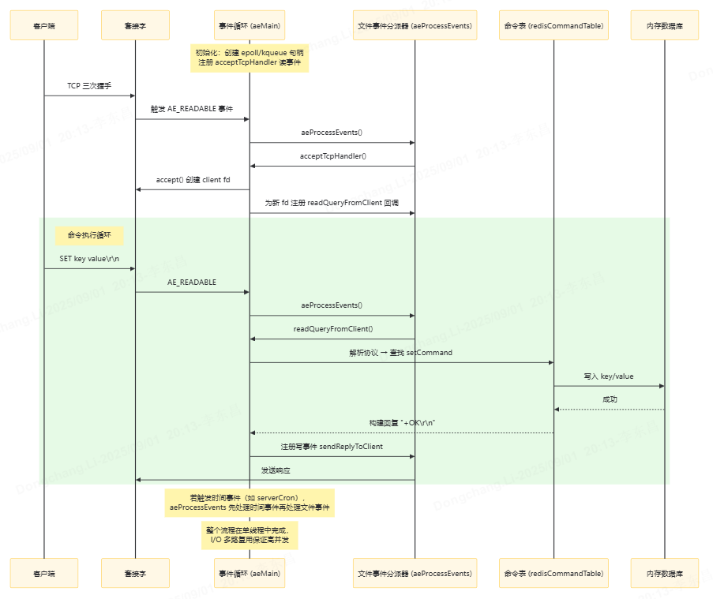
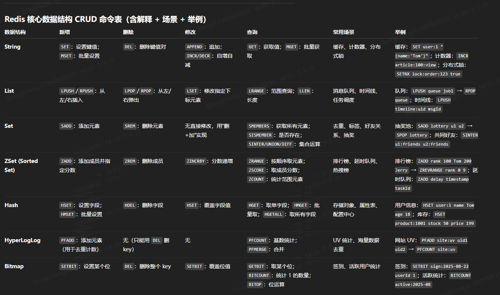

## Redis

1.  Redis为什么快。Redis是否单线程（单IO线程，新版本支持多线程）

    Redis的速度非常快，主要有以下几个原因：

    -  **完全基于内存操作**：Redis是一个内存数据库，所有的数据都存储在内存中。相比于传统的磁盘数据库，内存的读写速度要快几个数量级。
    -  **高效的数据结构**：Redis为不同的数据类型（如字符串、哈希、列表、集合、有序集合）设计了专门且高效的数据结构，使得数据操作非常迅速。
    -  **单线程模型**：Redis的核心命令的处理是单线程的。这避免了多线程环境下不必要的上下文切换和锁竞争带来的性能开销。因为CPU不是Redis的瓶颈，其瓶颈通常在内存和网络I/O。
    -  **I/O多路复用**：Redis使用I/O多路复用技术（如epoll）来处理大量的客户端连接。它将所有连接的I/O事件都放在一个队列中，用一个线程来处理，从而实现了高并发。I/O多路复用是一种高效的事件监听和分发机制，允许单个线程同时监视大量IO连接，并在连接真正就绪的时候才开始处理，避免了阻塞IO带来的
	线程开销和传统非阻塞IO的CPU轮询浪费，有select、poll、epoll三种实现方式，其中epoll方式效率最高

    准确来说：

    *   **核心网络处理是单线程的**：Redis处理客户端命令的请求和执行部分是单线程的。这就是我们通常说“Redis是单线程”的由来。
    *   **新版本引入了多线程**：从Redis 6.0开始，引入了多线程来处理网络I/O的读写和协议解析部分，以提高网络I/O的性能，但命令的执行依然是单线程的。这可以充分利用多核CPU的优势来处理网络请求，进一步提升整体性能。

    所以，简单地回答“单线程”或“多线程”都不完全准确。一个更好的回答是：**Redis的核心命令执行是单线程的，但在新版本中引入了多线程来优化网络I/O。**

    **AE事件**
    Redis为了跨平台处理I/O，自己写了个事件驱动框架，叫ae（asynchronous events），它是Redis的事件循环，主要分两类：文件事件和时间事件。
    - 文件事件：对应socket套接字的读写，底层依赖操作系统的多路复用机制，一个文件事件绑定一个回调函数，例如AE_READABLE--> 新连接到来/socket有数据可读；Redis不自己轮询，而是把socket注册内核，由内核负责监控。
    - 时间事件：定时任务例如定期清理过期键、AOF刷盘等，Redis自己维护了一个时间事件链表，每次事件循环时检查有没有该执行的任务。

    事件驱动机制：aeEventLoop里用一个无限循环，先处理所有已经触发的文件事件I/O，再处理时间事件，如果都没事，就调用epoll_wait阻塞等待新的事件。总结起来就是Redis中的ae事件循环就是“单线程 + I/O多路复用 + 回调分发”的高效的事件驱动系统。

    1. Redis 不自己轮询，而是把 socket 注册到 epoll/kqueue/select，由内核负责监控。

    2. I/O 事件触发 → 调用相应的 文件事件回调（比如 accept 新连接、读客户端命令、写响应）。时间事件触发 → 调用 时间事件回调（比如 serverCron、AOF刷盘）。

    3. 整个过程都在一个线程里串行完成，但因为 epoll/kqueue 是多路复用机制，所以能同时处理成千上万个连接。
        
        


2.  Redis的八种基本数据结构，原理和使用场景

    Redis直接暴露给用户的是5种基本数据类型（String, List, Hash, Set, ZSet）和一些扩展类型（如Bitmap, HyperLogLog, Geo, Stream）。这些类型的底层实现依赖于更基础的数据结构。我们这里主要讨论这些核心的底层数据结构。

    - 字符串（String）：底层实现是简单动态字符串（SDS），是一个动态的字符数组，支持修改和增长。存储了字符串长度，空间预分配，避免了频繁的内存分配和释放。
    - 哈希（Hash）：底层实现是哈希表（Hash Table），用于存储键值对。采用链式哈希解决哈希冲突，每个哈希桶存储一个链表，链表节点存储键值对。
    - 列表（List）：底层实现是双向链表（Doubly Linked List），支持在头部和尾部进行快速插入和删除操作。
    - 集合（Set）：底层实现是哈希表（Hash Table），用于存储唯一的元素。
    - 有序集合（ZSet）：Redis中zSet的底层实现有两种，当数据量小的时候，用ziplist压缩链表（本质是一个字节数组）存储，节省内存；当数据量大时采用跳表skiplist+hash表的组合。skiplist实现按score有序存储，hash表负责member -> score的映射，保证快速查找。跳表是通过多层有序单链表来实现快速查找，同一层的foward指针指向本层的下一个节点，节点内部通过维护level数组实现逻辑分层的效果，查找时从最高层级查，最高层仅包含少量的几个元素，最底层包含所有的元素，快速跳过不需要的元素。

	Redis中选择使用跳表的原因是基于性能、内存、复杂度的平衡。总结来说就是实现简单（不需要维护树的平衡操作逻辑）；范围遍历（范围遍历快；不像树的范围遍历复杂）；
	
    Redis中跳表的实现主要由两个核心的数据结构：1. 跳表节点（存储对象、score、前进后退指针以及leve数组层索引） 2. 跳表结构（包含了头尾节点）
	每次查找时，判断下一个节点是否大于目标，是的话，则将索引数组减一，进入下一层，继续向右查找。

    Redis核心命令：
    --

    

    Redis其他的一些扩展类型：
    - Bitmap：用于存储二进制位的数组，支持位操作。
    - HyperLogLog：用于估计集合的基数（不重复元素的数量）。
    - Geo：用于存储地理位置信息，支持距离计算和范围查询。
    - Stream：用于存储和处理有序的事件流。

3.  Redis持久化，AOF的刷盘时机，RDB的bgsave具体流程

    Redis的持久化有两种方式：AOF和RDB。
    - AOF：Append Only File，追加只写文件。Redis将所有写命令追加到一个文件中，当需要恢复数据时，按照顺序执行这些命令。AOF提供三种刷盘时机：
        - 每次写命令后刷盘：每次写命令后立即将命令追加到AOF文件中，确保数据的实时持久化，但是性能会受到影响。
        - 每秒刷盘一次：每秒将写命令追加到AOF文件中，平衡了性能和数据安全性。
        - 由操作系统决定：由操作系统决定何时将写命令追加到AOF文件中，性能最佳，但数据安全性较低。
        - 优势：持久化数据更加完整，因为AOF记录了所有的写命令，所以可以在发生故障时丢失的数据更少。
        - 劣势：AOF文件会不断增长，恢复数据的速度会变慢。
    - RDB：Redis Database，Redis数据库文件。RDB是将Redis内存中的数据快照保存到磁盘上的一个二进制文件。可以手动触发bgsave，也可以配置自动触发。
        - 优势：RDB文件是一个二进制文件，恢复数据的速度快。
        - 劣势：RDB文件记录的是某个时间点的快照，所以在发生故障时可能会丢失部分数据。
        - bgsave是Redis的一个命令，用于异步地将内存中的数据快照保存到磁盘上的RDB文件中。同样还有一个命令是save，它是同步的，会阻塞Redis的其他操作。
        - bgsave的具体流程：
            1. **创建子进程**：Redis fork一个子进程，子进程负责持久化操作，父进程继续处理客户端请求，保证服务的高可用性。
            2. **生成快照**：子进程将内存中的数据快照保存到一个临时的RDB文件中。
            3. **替换旧文件**：当子进程完成保存后，用临时文件替换原来的RDB文件。
            4. **通知父进程**：父进程收到子进程的通知，更新相关的统计信息，如RDB文件的大小、上次保存的时间等。

    生产环境一般采用结合AOF和RDB的方式，AOF记录所有的写命令，RDB记录某个时间点的快照，两者结合起来可以最大程度地保证数据的安全性和恢复速度。

4.  Redis内存淘汰策略，LRU，LFU具体怎么实现的
    - LRU（Least Recently Used）：最近最少使用算法，根据数据的最近访问时间来判断哪些数据是最近使用的，将最近最少使用的数据淘汰。Redis使用的是近似LRU算法，每次随机采样一部分数据进行LRU淘汰。基于内存和性能的考量，只使用了hash表缓存数据并没有专门针对LRU算法的双向链表。底层数据结构使用了lru字段（lru_clock）来维护数据最近一次访问的LRU时钟，每次key被访问时会更新该字段值。这种做法有一定缺陷，仅关注最近一次访问时间，没有考虑到数据的访问频率，无法避免突然访问的问题，例如某个冷门数据突然被访问了一次，那通过LRU淘汰时就可能会存活下来。
    - LFU（Least Frequently Used）：最近最少使用频率算法，根据数据的访问频率来判断哪些数据是最近使用的，将最近最少使用频率的数据淘汰。具体实现也是随机采样一部分数据进行LFU淘汰。采用hash表+双向链表的结构，数据在双向链表内按照热度值排序。热度值复用lru字段，将访问频率作为lru字段的低8位。
    - 随机淘汰：随机选择一个数据进行淘汰。
    - 不淘汰：不进行任何淘汰，当内存满时直接返回错误。
    - 内存淘汰策略的配置：当内存达到了maxmemory的阈值时，Redis会根据maxmemory-policy配置项来进行内存淘汰。默认是volatile-lru，即当内存满时，根据LRU算法淘汰最近最少使用的数据。

5.  Redis过期策略，定期删除和惰性删除的细节
    Redis的过期策略用于管理键的生命周期，确保过期的键能够被及时删除，释放内存空间。Redis的过期策略有两种：定时删除、定期删除和惰性删除。
    - 定时删除：在设置键过期时间的同时，也会为该键创建一个定时器，当定时器到期时，会立即删除该键。优点是及时删除过期的key，释放内存空间。缺点是会占用CPU资源可能会影响Redis的性能，需要合理配置扫描频率和数量。
    - 定期删除：Redis会周期性地抽取一部分设置了过期时间的key检查并删除过期key。具体实现就是使用后台线程+随机采样的方式定期执行过期key的检查和删除。优点是及时删除过期的key，释放内存空间。缺点是会占用CPU资源，需要合理配置扫描频率和数量。
    - 惰性删除：当访问一个key时，会判断它是否过期，如果过期了就会删除它。如果过期的key很多，会占用很多内存。优点是不会主动占用CPU检查，缺点是过期的key如果一直不被访问，可能会一直占用内存。

    - 过期key的删除策略的选择：
        - 如果对数据的访问频率比较高，建议使用惰性删除策略，因为定期删除策略会阻塞Redis的其他操作。
        - 如果对数据的访问频率比较低，建议使用定期删除策略，因为惰性删除策略会占用很多内存。
        - 可以采用惰性 + 定期的组合方式。

6.  Redis主从集群和哨兵模式的原理
    目前实现Redis高可用的模式有三种：主从同步、哨兵模式和分片集群模式。
    - 主从同步：Redis主从同步是指多个Redis节点之间通过复制（replication）机制实现数据同步和备份。提高系统的可用性和读写性能，是分担Redis读写压力、保证高可用的重要手段。其中，一个节点作为主节点（master），负责接收客户端的写请求和执行写操作；其他节点作为从节点（slave），负责复制主节点的数据和执行读操作。主从集群的原理是通过将主节点的写操作记录到AOF日志中，然后从节点通过读取AOF日志并执行其中的写操作来实现数据同步。
    - 哨兵模式：Redis哨兵模式是指多个Redis节点之间通过哨兵（sentinel）机制实现自动故障转移和监控。其中，多个哨兵节点负责监控主节点的状态和从节点的状态，并在主节点故障时自动将一个从节点升级为新的主节点，确保系统的高可用性。哨兵模式的原理是通过多个哨兵节点之间的通信和投票机制来实现自动故障转移。

7.  分片集群模式的原理，Gossip协议
    - 分片集群模式：Redis分片集群模式是指将Redis数据分布到多个节点上，每个节点负责存储一部分数据。通过分片集群模式，可以实现数据的水平扩展和负载均衡。
    - Gossip协议：Gossip协议是一种用于节点之间通信的协议，用于节点之间的发现、同步和协调。在分片集群模式中，Gossip协议用于节点之间的发现和同步分片信息。
    - 分片集群模式的原理：
        1. **数据分片**：将Redis数据分片到多个节点上，每个节点负责存储一部分数据。
        2. **路由计算**：根据key的哈希值计算出key应该存储在哪个节点上。
        3. **数据同步**：当一个节点的数据发生变化时，通过Gossip协议将数据同步到其他节点上。
        4. **数据读取**：当读取一个key时，根据key的哈希值计算出key应该存储在哪个节点上，然后从该节点上读取数据。
        5. **数据写入**：当写入一个key时，根据key的哈希值计算出key应该存储在哪个节点上，然后将数据写入该节点。
8.  缓存穿透，缓存雪崩，缓存击穿及对应的应对策略
    - 缓存穿透：缓存穿透是指查询一个不存在的数据，由于缓存没有命中，导致每次查询都要去数据库查询，从而导致数据库压力增大。应对策略包括：参数校验：对请求参数进行合法性校验，过滤明显非法的请求；布隆过滤器：在缓存层之前加布隆过滤器，快速判断数据是否存在；缓存空值：对查询结果为空的数据也在缓存中存储一个空值，设置较短过期时间；    
        - 布隆过滤器预防穿透的具体方案：
            - 新增数据落库成功后BF.add(id)，再写入缓存，可以定期重建BloomFilter来保证数据的缓慢增长
            - 读取数据时，先通过BloomFilter.exist(id)判断数据是否可能存在，如果不存在直接返回，不请求缓存和数据库，存在则走正常的缓存+数据库访问。同时注意数据库查到后需要回填缓存和BloomFilter。
            - 需要考虑维护BF的成本，例如冷启动从数据库中扫描主键并批量添加BloomFilter中，定期重建用于解决删除的情况
    - 缓存雪崩：缓存雪崩是指在缓存中存储的大量数据在同一时间过期或者Redis宕机，导致所有请求都去查询数据库，从而导致数据库压力增大。可能会出现在：缓存服务器宕机；大量缓存设置相同的过期时间；缓存预热不足的场景。应对策略：过期时间随机化；多级缓存；Redis高可用保证；服务降级。
    - 缓存击穿：某个热点数据过期的瞬间，有大量请求同时访问它。由于缓存没有过期命中，大量请求同时穿透到数据库，从而导致数据库压力增大。应对策略是设置热点数据永不过期；双缓存做备份，当热点数据缓存过期时，从备份缓存中读取数据。


9.  Redis的大Key，热Key如何应对
    - 大Key：大Key是指一个Key对应的值占用的内存空间很大，例如一个Hash类型的Key对应的值占用了100MB的内存空间。
        + 可以通过redis-cli --bigkeys命令扫描大Key
        + 可能会造成阻塞Redis主线程，性能下降
        + 解决方法
            - 数据结构优化，避免存储数据信息冗余
            - 压缩数据，例如使用压缩算法（如Snappy、Zlib）压缩数据，减少内存占用
    - 热Key：热Key是指一个Key被访问的频率很高，例如一个Hash类型的Key被访问的频率很高。热Key会导致Redis的性能下降，影响Redis的响应时间。应对策略是将热Key缓存到内存中，避免每次访问都去查询数据库。
        + 可以通过redis-cli --hotkeys命令扫描热Key
        + 可能会导致Redis单节点CPU使用率过高，响应变慢
        + 解决方法
            - 本地缓存
            - 热key复制；热key预加载
            - 读写分离

10. Redis是如何实现事务的
    - Redis事务的实现是通过MULTI、EXEC、DISCARD和WATCH命令来实现的。
    - MULTI命令：用于开启一个事务，为该客户端设置事务状态标志，后续的命令不会立即执行，而是被加入到事务队列中。
    - EXEC命令：按顺序执行事务队列中的所有命令。如果命令执行出错，该命令会失败，但事务不会回滚。其他命令会继续执行。
    - DISCARD命令：用于取消事务，清空事务队列。
    - WATCH命令：用于监控一个或多个键，如果在事务执行前有其他客户端修改了这些键，事务将被取消。

    - Redis事务不支持回滚：错误不会导致整个事务回滚。
    - 性能高但功能简单：适合简单场景

11. Redis实现分布式锁
    - 分布式锁：分布式锁是指在分布式系统中，多个进程或线程在不同的节点上同时访问共享资源时，需要协调它们的访问顺序，避免冲突。
    - 实现分布式锁的方式有很多种，其中比较常用的是基于Redis的分布式锁。基于Redis的分布式锁的实现原理是利用Redis的setnx命令（set if not exists），当多个进程或线程同时执行setnx命令时，只有一个进程或线程能够成功执行，其他进程或线程会失败。成功执行的进程或线程可以认为是获得了分布式锁，其他进程或线程可以等待或重试。
    - 基于Redis的分布式锁的实现方式有很多种，例如通过lua脚本实现分布式锁，通过redlock算法实现分布式锁等。
    - 基于lua脚本实现分布式锁的原理是利用Redis的eval命令执行Lua脚本，lua脚本在Redis内部执行可以把多条命令封装为原子操作，因此用来安全释放锁。在脚本中判断锁是否存在，如果不存在则设置锁并返回成功，否则返回失败。
    - 为什么要用lua脚本？问题在释放锁，如果直接DEL key，可能会把别人的锁删掉，所以需要先判断锁的value是否是字节当初设置的，如果相等才删除锁，而这个“判断” + “删除” 必须是原子操作，因此就用到了luat脚本，将多条命令封装为原子操作，用来安全释放锁。
        - 脚本如下：
        ```
        local lockKey = KEYS[1]
        local clientId = ARGV[1]
        local expireTime = ARGV[2]
        local result = redis.call("SET", lockKey, clientId, "NX", "EX", expireTime)
        if result then
            return 1
        else
            return 0
        end
        ```
        - 获取锁的时候，会执行一段lua脚本，调用redis的setnx命令，当锁不存在时加锁，设置锁的key和value，过期时间为锁的超时时间。如果加锁失败，说明锁已经被其他进程或线程获得，返回失败。
        - 释放锁的时候，会执行一段lua脚本，调用redis的del命令，通过比较锁的value是否与客户端的value相等，相等则删除锁，否则不删除。
        - lua脚本执行是原子性的，不会被其他进程或线程中断，确保了锁的获取、释放是安全的。

    - 基于redlock算法实现分布式锁的原理是利用多个Redis节点同时设置锁，只有当大多数节点都设置成功时，才认为获得了分布式锁。
    - redlock算法的实现步骤：
        1. 客户端向多个Redis节点发送SET命令，设置锁的key和value，过期时间为锁的超时时间。
        2. 客户端收到大多数节点的回复后，判断是否获得了锁。如果获得了锁，客户端返回成功；如果没有获得锁，客户端向所有节点发送DEL命令，删除所有设置的锁。
        3. 客户端根据返回结果判断是否获得了锁。如果获得了锁，客户端执行业务逻辑；如果没有获得锁，客户端等待一段时间后重试。
        4. 客户端在业务逻辑执行完成后，向所有节点发送DEL命令，删除锁。

### 刁钻问题

1.  如果Redis主从架构下，使用惰性删除时，从节点的key已经到期了，读从节点时会怎么样
    - 当从节点读取一个过期的key时，从节点会检查key是否过期，如果过期了就会像主节点一样执行惰性删除：删除该key并返回一个空值（null）给客户端。
    - 但从节点不会向主节点或其他从节点同步删除该key的命令，因为从节点的key过期时间是从主节点同步过来的，主节点不会主动通知从节点删除key。
    - 从节点的key过期时间是从主节点同步过来的，主节点会在key过期时向所有从节点发送一个DEL命令，从节点会在收到DEL命令后执行惰性删除。
    - 如果主从复制延迟很大，从节点在读取时读取到过期的key.
    **总结**：在Redis主从架构中使用惰性删除时，读取从节点不会返回已过期键（3.2+版本），从节点会本地检查并删除，但真正的同步删除由主节点负责。这设计确保了数据一致性和读取安全性。

2.  Redis的Hash数据结构在扩容时是如何渐进式扩容的，如果某个Key一直不被访问，可以顺利扩容吗
    - 首先Redis的Hash使用了hash表作为基本的存储结构，每个字典/Hash结构由两个哈希表组成，每个哈希表中存储了其节点数组、大小等。其中新表是在扩容时新建的。
    - 当哈希表的负载因子超过阈值时，会触发渐进式扩容，进行rehash操作。
    - 每次对字典的操作（增删改查）都会触发迁移ht[0]中的一个桶到ht[1]中。
    - 迁移完成后，会将ht[1]设置为ht[0]，并且释放旧表。
    - Redis也会通过定时任务确保即使没有对字典进行操作，也会渐进式地迁移桶到新表中。
    - 如果某个Key一直不被访问，也是可以顺利扩容的，Redis中的渐进式rehash操作只要字典中其他元素有任何操作，都会被触发，另外，每次搬迁都是桶级别的，跟单个元素无关。而且还会有定时任务来兜底。

3. Redis分片集群扩容的过程是怎么样，客户端请求如何重定向的，Redis的slot模式和一致性哈希有哪些区别

4. Redission有了解过吗？redissoin的时间轮？

    Redission是基于Redis的Java分布式框架，不仅是一个Redis客户端，而且还封装了很多常用的分布式组件，例如分布式锁、分布式集合、分布式队列、布隆过滤器等。

    在redisson中，时间轮（Time wheel）主要被用来做延迟任务调度，从原理上看，时间轮是一种高效的定时器实现结构，适合管理大量的定时任务。可以像一个钟表盘：
    - 每个格子代表一个时间槽
    - 把需要延迟执行的任务放到对应的槽里
    - 表盘指针按固定步长转动，当指针走到某个槽时，会触发其里面的任务。

    优点在于，不需要频繁调整优先队列，只需要简单的数组+指针+链表即可高效维护大批量的延迟任务，复杂度接近O(1);

    运行过程：
    1. 新任务进来时，根据延迟时间计算出它应该落在哪个槽
    2. 每次tick（间隔）指针就走到下一个槽
    3. 当指针走到某个槽，就检查这个槽里的任务，到期了就执行，没到期就重新挂到未来的槽中。

    Redisson中的分布式锁，也是Redis + 基于lua脚本 + 看门狗线程实现的

    利用lua脚本在redis中的原子性，做加锁、释放锁的操作；同时会开启一个看门狗线程，针对这个锁，每隔一段时间，自动给锁续期，这样锁的过期时间就和业务线程的业务耗时绑定，只要业务还在执行，锁就一直存在，不会说过期被其他线程获取

    优势是：可重入、自动续期、还有更高级的公平锁、读写锁等高级锁功能。